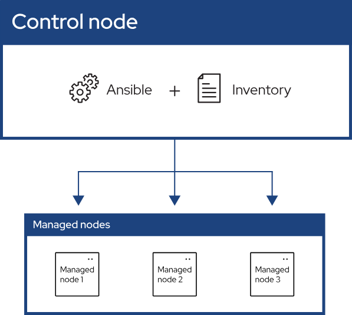
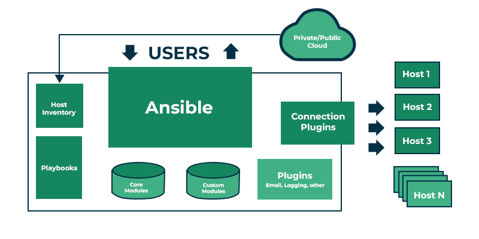
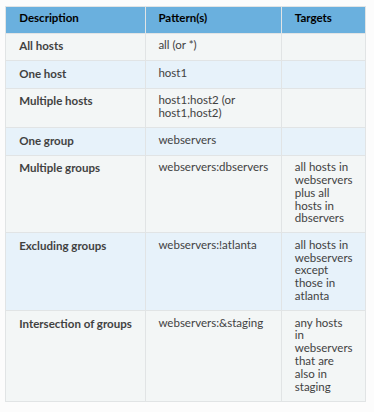

# Ansible


* Ansible is a Python-based, open-source IT automation tool.

* Ansible automates the management of remote systems and controls their desired state.

* Ansible is Agent-less tool: performs its functions without requiring dedicated software or "agents" to be installed on the devices being monitored or managed.it establish connections and execute commands remotely using `ssh` or `WinRM`.

* _Agent-based system: systems require a specialized software component, known as an "agent," to be installed and running on each target machine, receiving instructions and executing tasks locally on the managed host, agent-based tools: Puppet and Chef._

* Idempotence and predictability: When the system is in the desired final state which the playbook describes, Ansible does not change anything, even if the playbook runs multiple times.

## Ansible Architecture

* 

* 

* Users: system administrators, DevOps engineers, or anyone who needs to automate tasks on servers or cloud resources.

* Control node: A system on which Ansible is installed. You run Ansible commands

* Managed node: A remote system, or host, that Ansible controls.

* Inventory: A list of managed nodes that are logically organized. it contains the IP addresses or hostnames of the servers, virtual machines, or cloud instances.

* Playbooks: YAML file containing a series of tasks , It defines the actions that Ansible will perform on the hosts defined in the inventory.They act as script for Ansible automation.

* Tasks: Units of action that combine a module and its arguments along with some other parameters.

* Modules: Modular units of code executed on managed nodes to perform specific tasks.

  * Core Modules: the default modules that come with Ansible. such as `apt` in ubuntu.

  * Custom Modules: Ansible's built-in modules might not be enough. You can create custom modules to meet specific needs.

* Plugins: Pieces of code that expand Ansible’s core capabilities

  * Connection Plugins: `SSH,winRM` handle how Ansible connects to the remote machines.

  * Filter Plugins: manipulate data

  * Callback plugins: control what displayed in the console.


## Building an Inventory file.

* the default location for inventory is `/etc/ansible/hosts`

* inventory file specifies the host or group of hosts.

* Static Inventory: contains a fixed lists of the hosts and groups.documented in INI or YAML type of syntax.
* _examples:_
1. 
```ini
[webservers]
webserver1.example.com
webserver2.example.com

[databases]
dbserver1.example.com
dbserver2.example.com
```
2. groups with ssh
```ini
# Group: Web Servers
[webservers]
web1.example.com ansible_user=ubuntu ansible_port=22
web2.example.com ansible_user=ec2-user ansible_port=2222

# Group: Database Servers
[databases]
db1.example.com ansible_user=admin ansible_port=22 ansible_ssh_private_key_file=/home/admin/.ssh/id_rsa

# Group: Production (combining other groups)
[production:children]
webservers
databases
```
3. YAML format:
```yaml
all:
  children:
    webservers:
      hosts:
        web1.example.com:
          ansible_user: ubuntu
          ansible_port: 22
        web2.example.com:
          ansible_user: ec2-user
          ansible_port: 2222
    databases:
      hosts:ansible-gala
        db1.example.com:
          ansible_user: admin
          ansible_port: 22
          ansible_ssh_private_key_file: /home/admin/.ssh/id_rsa
    production:
      children:
        webservers:
        databases:
```


* Dynamic Inventory: generated at runtime by an external script or program that queries a source (such as a cloud provider API) to determine the inventory
```python
#!/usr/bin/env python

import json

def get_inventory():
    inventory = {
        "webservers": {
            "hosts": ["webserver1", "webserver2"],
            "vars": {"common_var": "common_value_for_webservers"}
        },
        "databases": {
            "hosts": ["dbserver1", "dbserver2"],
            "vars": {"common_var": "common_value_for_databases"}
        }
    }
    print(json.dumps(inventory))

if __name__ == "__main__":
    get_inventory()
```

### Groups
  * Default Groups

      * `all` : contains every host
      * `ungrouped` : group contains all hosts that do not belong to any other group
      * Every host always belongs to at least two groups

  * Grouping groups: parent/child group relationships.
  
  _Parent groups known as nested groups or groups of groups_

  _In INI format, use the `:children` suffix._
  _In YAML format, use the `children:` entry._

### Adding Range of Hosts.

```ini
    [webservers]
    www[01:50].example.com
    www[01:50:2].example.com # increments between sequence numbers by 2
```

### [Connections](https://docs.ansible.com/ansible/latest/inventory_guide/intro_inventory.html#id21):

  * Ansible uses OpenSSH by default, it supports ControlPersist "an optional configuration setting in `.ssh/config` file" 

  * `ansible_connection=type` Specifies the connection type to the host, such as `ssh,docker`

  * `ansible_host=host`: Specifies the resolvable name or IP of the host to connect to. such as `localhost` 

  * `ansible_user=username` The username to use when connecting (logging in) to the host.

  * `ansible_password` The password to use to authenticate to the host. 

### Adding Variables to inventory
```ini
[atlanta]
host1
host2

[atlanta:vars]
ntp_server=ntp.atlanta.example.com
proxy=proxy.atlanta.example.com
```

### Patterns

`ansible <pattern> -m <module> -a "<module options>"`



* Processing order 
  : and ,
  &
  !

### [Setting SSH](https://www.ssh.com/academy)


### Test Inventory file

```bash
# view the inventory structure
ansible-inventory -i inventory_file.ini --list 

# create inventory graph
ansible-inventory -i inventory_file.ini --graph 

# Output specific host info
ansible-inventory -i inventory_file.ini --host HOST_NAME 
```

## Building a Playbook
```yaml
- name: My first play
  hosts: myhosts
  tasks:
   - name: Ping my hosts
     ansible.builtin.ping:

   - name: Print message
     ansible.builtin.debug:
       msg: Hello world
```

### Run Playbook

`ansible-playbook playbook.yaml`

  * Gathering Facts : Ansible gathers information about the hosts in the inventory file.
  * `ok` : means run succeefully 

* Run the playbook in Check mode "execute the playbook without changes" test playbooks before implement them in a production environment.

`ansible-playbook --check playbook.yaml`

### Verifying playbooks
```bash
ansible-palybook --check playbook.yaml

ansible-playbook --syntax-check playbook.yaml

ansible-playbook --list-hosts playbook.yaml

ansible-playbook --list-tasks playbook.yaml

ansible-playbook playbook.yml --start-at-task="install packages" # To start executing your playbook at a particular task

ansible-playbook playbook.yaml --step # To execute a playbook interactively, Ansible stops on each task and asks if it should execute that task.


```
### Playbook

* Contains Plays "main context for Ansible execution", maps managed nodes (hosts) to tasks

* Play Contains (Tasks,Roles,Variables) 

  * Tasks: define the action to be applied to the managed nodes.

  * Roles: provide a structured way to organize tasks, templates, files, and variables.

  * Handlers: it is a task that only run when notified.


#### Roles

* ansible role has a defined directory structure with seven main standard directories.

* roles_path. The default search path is `~/.ansible/roles:/usr/share/ansible/roles:/etc/ansible/roles`.

* by default Ansible will look in most role directories for a main.yml file for relevant content (also main.yaml and main)
```
roles/
    common/               # this hierarchy represents a "role"
        tasks/            #
            main.yml      #  <-- tasks file can include smaller files if warranted
        handlers/         #
            main.yml      #  <-- handlers file
        templates/        #  <-- files for use with the template resource
            ntp.conf.j2   #  <------- templates end in .j2
        files/            #
            bar.txt       #  <-- files for use with the copy resource
            foo.sh        #  <-- script files for use with the script resource
        vars/             #
            main.yml      #  <-- variables associated with this role
        defaults/         #
            main.yml      #  <-- default lower priority variables for this role
        meta/             #
            main.yml      #  <-- role dependencies
        library/          # roles can also include custom modules
        module_utils/     # roles can also include custom module_utils
        lookup_plugins/   # or other types of plugins, like lookup in this case

    webtier/              # same kind of structure as "common" was above, done for the webtier role
    monitoring/           # ""
    fooapp/               # ""
```

* __Using Role__

  - at the play level with the roles option: This is the classic way of using roles in a play.

  - at the tasks level with `include_role`: You can reuse roles ***dynamically*** anywhere in the tasks section of a play using `include_role`.

  - at the tasks level with `import_role`: You can reuse roles ***statically*** anywhere in the tasks section of a play using `import_role`.

```yaml
  ---
- hosts: webservers
  roles:
    - common
    - webservers
```


* __*Example*__
```yaml
# roles/example/tasks/main.yml
- name: Install the correct web server for RHEL
  import_tasks: redhat.yml
  when: ansible_facts['os_family']|lower == 'redhat'

- name: Install the correct web server for Debian
  import_tasks: debian.yml
  when: ansible_facts['os_family']|lower == 'debian'

# roles/example/tasks/redhat.yml
- name: Install web server
  ansible.builtin.yum:
    name: "httpd"
    state: present

# roles/example/tasks/debian.yml
- name: Install web server
  ansible.builtin.apt:
    name: "apache2"
    state: present
```

#### Loops
  
```yaml
- name: Add several users
  ansible.builtin.user:
    name: "{{ item }}"
    state: present
    groups: "wheel"
  loop:
     - testuser1
     - testuser2

---

- name: Add several users
  ansible.builtin.user:
    name: "{{ item.name }}"
    state: present
    groups: "{{ item.groups }}"
  loop:
    - { name: 'testuser1', groups: 'wheel' }
    - { name: 'testuser2', groups: 'root' }

---

- name: Retry combined with a loop
  uri:
    url: "https://{{ item }}.ansible.com"
    method: GET
  register: uri_output
  with_items:
  - "galaxy"
  - "docs"
  - "forum"
  - "www"
  retries: 2
  delay: 1
  until: "uri_output.status == 200"

---

- name: Show all the hosts in the inventory
  ansible.builtin.debug:
    msg: "{{ item }}"
  loop: "{{ groups['all'] }}"

- name: Show all the hosts in the current play
  ansible.builtin.debug:
    msg: "{{ item }}"
  loop: "{{ ansible_play_batch }}"

```

#### Conditions

* Conditionals based on ansible_facts

```yaml
tasks:
  - name: Shut down Debian flavored systems
    ansible.builtin.command: /sbin/shutdown -t now
    when: ansible_facts['os_family'] == "Debian"
---
tasks:
    - name: Get the CPU temperature
      set_fact:
        temperature: "{{ ansible_facts['cpu_temperature'] }}"

    - name: Restart the system if the temperature is too high
      when: temperature | float > 90
      shell: "reboot"
```
* Conditions based on registered variables

```yaml
tasks:
  - name: Register a variable, ignore errors and continue
    ansible.builtin.command: /bin/false
    register: result
    ignore_errors: true

  - name: Run only if the task that registered the "result" variable fails
    ansible.builtin.command: /bin/something
    when: result is failed

  - name: Run only if the task that registered the "result" variable succeeds
    ansible.builtin.command: /bin/something_else
    when: result is succeeded

  - name: Run only if the task that registered the "result" variable is skipped
    ansible.builtin.command: /bin/still/something_else
    when: result is skipped

  - name: Run only if the task that registered the "result" variable changed something.
    ansible.builtin.command: /bin/still/something_else
    when: result is changed
```
* based on variables
```yaml
tasks:
    - name: Run the command if "foo" is defined
      ansible.builtin.shell: echo "I've got '{{ foo }}' and am not afraid to use it!"
      when: foo is defined

    - name: Fail if "bar" is undefined
      ansible.builtin.fail: msg="Bailing out. This play requires 'bar'"
      when: bar is undefined
```

#### Handlers 

```yaml
tasks:
  - name: Restart everything
    command: echo "this task will restart the web services"
    notify: "restart web services"

handlers:
  - name: Restart memcached
    service:
      name: memcached
      state: restarted
    listen: "restart web services"

  - name: Restart apache
    service:
      name: apache
      state: restarted
    listen: "restart web services"
```

#### Debugging

* fix errors during execution instead of editing your playbook

* using `debugger` keyword

  - __options__

    |Value| Result|
    |---|---|
    |always	|Always invoke the debugger, regardless of the outcome|
    |never|Never invoke the debugger, regardless of the outcome|
    |on_failed|Only invoke the debugger if a task fails|
    |on_unreachable|Only invoke the debugger if a host is unreachable|
    |on_skipped|Only invoke the debugger if the task is skipped|

  - __commands__

    |Command |Shortcut| Action|
    |---|---|---|
    |print|p|Print information about the task|
    |task.args[key] = value|no shortcut|Update module arguments|
    |task_vars[key] = value|no shortcut|Update task variables (you must update_task next)|
    |update_task|u|Recreate a task with updated task variables|
    |redo|r|Run the task again|
    |continue|c|Continue executing, starting with the next task|
    |quit|q|Quit the debugger|

```yaml
- name: Play
  hosts: all
  debugger: never # at the play level
  tasks:
    - name: Execute a command
      ansible.builtin.command: "false"
      debugger: on_failed # at this task only
```

* debugger in configuration
```cfg
[defaults]
enable_task_debugger = True
```

## Ansible Commands

1. __ad hoc__

  * single-line command executed from the Ansible control node to perform a task on one or more managed nodes without the need for a full playbook.

  * [`ansible [pattern] -m [module] -a "[module options]"`](https://docs.ansible.com/ansible/latest/cli/ansible.html)

  * show facts
  `ansible <hostname> -m ansible.builtin.setup`
2. [__ansible-config__](https://docs.ansible.com/ansible/latest/cli/ansible-config.html)

  * default ansible config file `~/.ansible/ansible.cfg` and `/etc/ansible/ansible.cfg`

```bash
ansible-config init --disabled > ansible.cfg # disable all configurations

ansible-config init --disabled -t all > ansible.cfg  # include available plugins

ansible-config dump # show the current settings, merge specified configuration

ansible-config view --config config_file # display the current config file

```

3. [__ansible-doc__](https://docs.ansible.com/ansible/latest/cli/ansible-doc.html)

```bash
ansible-doc -l # list all modules
ansible-doc -s <module> # list the snippts of the module
```

4. [__ansible-galaxy__](https://docs.ansible.com/ansible/latest/cli/ansible-galaxy.html#ansible-galaxy)

  * manage Ansible roles and collections.

```bash
ansible-galaxy init > roles # initialize the roles dir
```

5. [__ansible-inventory__](https://docs.ansible.com/ansible/latest/cli/ansible-inventory.html)

  * show ansible invintory informations.

6. [__ansible-playbook__](https://docs.ansible.com/ansible/latest/cli/ansible-playbook.html)

7. [__ansible-pull__](https://docs.ansible.com/ansible/latest/cli/ansible-pull.html)

  * pulls playbooks from a VCS repo and executes them on target host.
  
8. [__ansible-vault__](https://docs.ansible.com/ansible/latest/cli/ansible-vault.html)

  * encryption/decryption utility for Ansible data files

