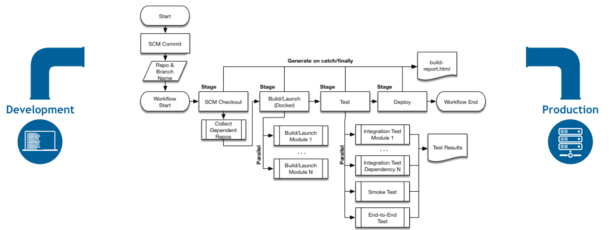

# Important notes for Jenkins

## [Initial Settings](https://www.jenkins.io/doc/book/installing/initial-settings/)

## Important plugins

1. Warnings Next Generation plugin

2. Sending Slack notifications

3. lockable resources


## Credentials

* Jenkins can store the following types of credentials:

    Secret text - a token such as an API token or GitHub personal access token,

    Username and password - which could be handled as separate components or as a colon separated string in the format username:password (read more about this in Handling credentials),

    Secret file - which is essentially secret content in a file,

    SSH Username with private key - an SSH public/private key pair,

    Certificate - a PKCS#12 certificate file and optional password, or

    Docker Host Certificate Authentication credentials.


    * Global - if the credential/s to be added is/are for a Pipeline project/item. Choosing this option applies the scope of the credential/s to the Pipeline project/item "object" and all its descendant objects.

    * System - if the credential/s to be added is/are for the Jenkins controller itself to interact with system administration functions, such as email authentication, agent connection, etc. Choosing this option applies the scope of the credential/s to a single object only.

## Agents

* Jenkins agents can be launched in physical machines, virtual machines, Kubernetes clusters, and with Docker images.


## Pipeline

features of Pipeline:

Code: Pipelines are implemented in code and typically checked into source control, giving teams the ability to edit, review, and iterate upon their delivery pipeline.

Durable: Pipelines can survive both planned and unplanned restarts of the Jenkins controller.

Pausable: Pipelines can optionally stop and wait for human input or approval before continuing the Pipeline run.

Versatile: Pipelines support complex real-world CD requirements, including the ability to fork/join, loop, and perform work in parallel.

Extensible: The Pipeline plugin supports custom extensions to its DSL and multiple options for integration with other plugins.



* Pipeline can be created in one of the following ways:

Through Blue Ocean - after setting up a Pipeline project in Blue Ocean, the Blue Ocean UI helps you write your Pipeline’s Jenkinsfile and commit it to source control.

Through the classic UI - you can enter a basic Pipeline directly in Jenkins through the classic UI.

In SCM - you can write a Jenkinsfile manually, which you can commit to your project’s source control repository. 

## Pipeline Syntax

### Sections
* agent

    * Parameters

        `none`   each stage section will need to contain its own agent section

        `any`    execute the Pipeline, or stage, on any available agent. For example:

        label  

        * `agent { label 'my-defined-label' }` execute the Pipeline, or stage, on an agent available in the Jenkins environment with the provided label.
        
        *  Label conditions can also be used:  `agent { label 'my-label1 && my-label2' }` or `agent { label 'my-label1 ||my-label2' }`

        
        node

        * `agent { node { label 'labelName' } }` behaves the same as `agent { label 'labelName' }`, but node allows for additional options (such as `customWorkspace`).


        docker

        * `agent { docker 'maven:3.9.3-eclipse-temurin-17' }`

        * docker accept `args` and `registryUrl` and `registryCredentialsId`  
        
        * ```
            agent {

                docker {
            
                    image 'myregistry.com/node'
            
                    label 'my-defined-label'
            
                    registryUrl 'https://myregistry.com/'
            
                    registryCredentialsId 'myPredefinedCredentialsInJenkins'
                }
            }
        ```

* post

    * The post section defines one or more additional steps that are run upon the completion of a Pipeline’s or stage’s run (depending on the location of the post section within the Pipeline)

    * conditions
        1. always
            Run the steps in the post section regardless of the completion status of the Pipeline’s or stage’s run.

        2. changed
            Only run the steps in post if the current Pipeline’s run has a different completion status from its previous run.

        3. fixed
            Only run the steps in post if the current Pipeline’s run is successful and the previous run failed or was unstable.

        4. regression
            Only run the steps in post if the current Pipeline’s or status is failure, unstable, or aborted and the previous run was successful.

        5. aborted
            Only run the steps in post if the current Pipeline’s run has an "aborted" status, usually due to the Pipeline being manually aborted. This is typically denoted by gray in the web UI.

        6. failure
            Only run the steps in post if the current Pipeline’s or stage’s run has a "failed" status, typically denoted by red in the web UI.

        7. success
            Only run the steps in post if the current Pipeline’s or stage’s run has a "success" status, typically denoted by blue or green in the web UI.

        8. unstable
            Only run the steps in post if the current Pipeline’s run has an "unstable" status, usually caused by test failures, code violations, etc. This is typically denoted by yellow in the web UI.

        9. unsuccessful
            Only run the steps in post if the current Pipeline’s or stage’s run has not a "success" status. This is typically denoted in the web UI depending on the status previously mentioned (for stages this may fire if the build itself is unstable).

        10. cleanup
            Run the steps in this post condition after every other post condition has been evaluated, regardless of the Pipeline or stage’s status.

* stages
    * Containing a sequence of one or more stage directives, the stages section is where the bulk of the "work" described by a Pipeline will be located

```
    pipeline {
    agent any
    stages { 
        stage('Example') {
            steps {
                echo 'Hello World'
            }
        }
    }
}
```

* steps
    The steps section defines a series of one or more steps to be executed in a given stage directive.


### Directives

1. environment

    supports a special helper method credentials() which can be used to access pre-defined Credentials
pipeline {
    agent any
    stages {
        stage('Example Username/Password') {
            environment {
                SERVICE_CREDS = credentials('my-predefined-username-password')
            }
            steps {
                sh 'echo "Service user is $SERVICE_CREDS_USR"'
                sh 'echo "Service password is $SERVICE_CREDS_PSW"'
                sh 'curl -u $SERVICE_CREDS https://myservice.example.com'
            }
        }
        stage('Example SSH Username with private key') {
            environment {
                SSH_CREDS = credentials('my-predefined-ssh-creds')
            }
            steps {
                sh 'echo "SSH private key is located at $SSH_CREDS"'
                sh 'echo "SSH user is $SSH_CREDS_USR"'
                sh 'echo "SSH passphrase is $SSH_CREDS_PSW"'
            }
        }
    }
}

2. options

    checkoutToSubdirectory
    disableResume
    quietPeriod
    skipDefaultCheckout

3. parameters

string
A parameter of a string type, for example: parameters { string(name: 'DEPLOY_ENV', defaultValue: 'staging', description: '') }.

text
A text parameter, which can contain multiple lines, for example: parameters { text(name: 'DEPLOY_TEXT', defaultValue: 'One\nTwo\nThree\n', description: '') }.

booleanParam
A boolean parameter, for example: parameters { booleanParam(name: 'DEBUG_BUILD', defaultValue: true, description: '') }.

choice
A choice parameter, for example: parameters { choice(name: 'CHOICES', choices: ['one', 'two', 'three'], description: '') }. The first value is the default.

password
A password parameter, for example: parameters { password(name: 'PASSWORD', defaultValue: 'SECRET', description: 'A secret password') }.

4. triggers

5. tools

6. input

7. When