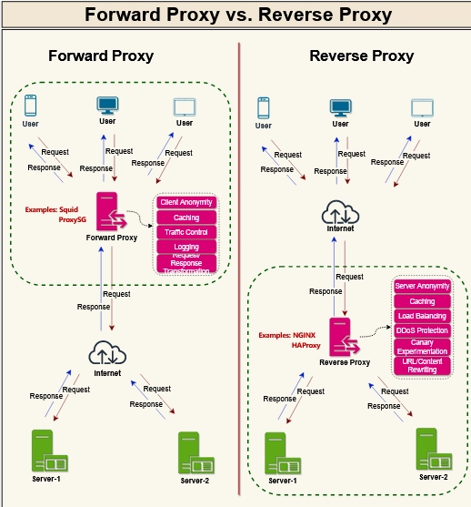

# NGINX notes


> free , open source , BSD license , developed by Igor Sysoev to solve _C10K_ problem "challenge to handel 10000 concurent connection" _concurent connection is multiple connections at the same time_ 

---

## Table of Contents

1. [Use Cases](#used-as)
   - [Web Server](#1-webserver)
   - [Load Balancer](#2-load-balancer)
   - [Reverse Proxy](#3-reverse-proxy)
   - [Forward Proxy](#4-forward-proxy)
   - [Caching](#5-caching)
2. [Configuration](#nginx-configuration)
   - [Directory Structure](#nginx-directory-structure)
3. [Firewall Setup](#using-firewall)
4. [Redirect & Rewrite](#redirect-and-rewrite)
5. [Security](#security)
   - [SSL Certificates](#creating-certificates)
   - [Basic Authentication](#restricting-access-with-http-basic-authentication)
   - [IP Restrictions](#access-restriction-by-ip-address)
6. [Rate Limiting](#rate-limit)
7. [Compression](#compression)
8. [WebSocket Proxying](#websocket-proxying)
9. [Monitoring & Troubleshooting](#monitoring-troubleshooting)
10. [Common Errors](#common-errors)
11. [References](#references)

---

## Used as 

## 1. Webserver : 
* is a system (hardware or software or combination) that delivers web content (media,httml,css,php,python,ruby) to the user over the internet. 

            _hardware ==> computer store the web server software and website files_

            _software* ==> http or https server which handels the delivery of files_
 
            _static website ==> the elements "html,css,javaS,fixed media" on the page remain the same_
 
            _dynamic website ==> the elements "python,php,ruby,node.js" are generated in real time or changed based on the user_
 
            _static uses client side languages "html,JS,css" and dynamic uses server side languages "php,ruby,python"_
 
            _https encrypted TLS/SSL "transport layer security and secure sockets layer" "protocols used to encrypt communication betwwen client and server",TLS 1.2 Widely Used in Production environments, TLS 1.3 is Best performance and security_
            
>> ### [Http Response Status Code](https://developer.mozilla.org/en-US/docs/Web/HTTP/Reference/Status)

1. **Informational**

| code | message | discrepstion |
| --- | --- | --- |
| 100 | continue | the initial part of a request has been received by the server and has not yet been rejected. |
| 101 | Switching Protocols | This code is sent in response to an Upgrade request header from the client and indicates the protocol the server is switching to. |
| 102 | Processing | the server has received and is currently processing a full request, but no final response is available yet. |
| 103 | Early Hints | server can send to a client while it is still preparing the final response to a request. |            

2. **Success**

| code | message | discrepstion |
| --- | --- | --- |
| 200 | ok | client's request to a server has been successfully processed.success depends on HTTP method |
| 201 | Created | The request was successful, and a new resource was created as a result (after a POST or PUT request). |
| 204 | No Content | The server successfully processed the request, but there is no content to return (e.g., a successful DELETE operation). |

3. **Redirection**

| code | message | discrepstion |
| --- | --- | --- |
| 301 | Moved Permanently | The requested resource has been permanently moved to a new URL. |
| 302 | Found (Temporary Redirect) | The requested resource is temporarily located at a different URL. |
| 304 | Not Modified | The client's cached version of the resource is still valid, and no new content needs to be sent. |

4. **Client Error**

| code | message | discrepstion |
| --- | --- | --- |
| 400 | Bad Request |  The server cannot process the request due to malformed syntax (e.g., an invalid URL or incorrect parameters). |
| 401 | Unauthorized | The request requires user authentication. |
| 402 | Payment Required | requested content is not available until the client makes a successful payment. |
| 403 | Forbidden | The server understood the request but refuses to authorize it, typically due to insufficient permissions. | 
| 404 | Not Found | The most widely recognized error code, indicating the server could not find the requested resource. |

5. **Server Error** 

| code | message | discrepstion |
| --- | --- | --- |
| 500 | Internal Server Error | A generic error indicating an unexpected condition on the server prevented it from fulfilling the request. |
| 501 | Not Implemented | indicates that the server does not support the functionality required to fulfill the request. |
|502 | Bad Gateway | ndicates that a server, while acting as a gateway or proxy, received an invalid response from an upstream server. |
| 503 | Service Unavailable|  The server is temporarily unable to handle the request, often due to maintenance or overload. |

  
>>> ### NGINX Worker Processes
     Worker processes handling client connections and processing requests. _The master process manages these workers_, including starting, stopping, and reloading them.

>>> ### The Event Loop
     Core of Worker Efficiency: At the heart of each worker process is an event loop. This loop continuously monitors for I/O events (e.g., new connections, data ready to be read, data ready to be written) on all active connections. 

>>> ### Workflow:
    1. The worker process enters the event loop.
    2. It listens for I/O events on active connections.
    3. When an event (e.g., a new client connection, data received from a client, data sent to a client) is detected, the worker processes the relevant action for that specific event.
    4. After processing, the worker returns to the event loop to await the next event on any of its managed connections.


## 2. Load Balancer : 
* distribute incoming requests across multiple servers , nginx prevent backend server from becoming a bottleneck.without load balancer ,every request hits one server.
```
       upstream backend {
            server backend1.example.com;
            server backend2.example.com max_fails=3 fail_timeout=30s;
            }


        server {
            listen 80;
            location / {
                proxy_pass http://backend;
            }
        }
```
> #### Load Balancing Methods

1. **Round Robin** (default) : distributes requests sequentially to each server in the upstream group. It is suitable for applications where requests are relatively short and uniform in processing time._no directive for enabling it_.

2. **Least Connections** : A request is sent to the server with the least 
number of active connections.
```
upstream backend {
    least_conn;
    server backend1.example.com;
    server backend2.example.com;
}
```
3. **IP Hash** : Ensures the same client IP always hits the same server,_either the first three octets of the IPv4 address or the whole IPv6 address is used to calculate the hash value._
```
upstream backend {
    ip_hash;
    server backend1.example.com;
    server backend2.example.com;
}
```
4. **Least Time** (NGINX Plus only) : NGINX Plus selects the server with the lowest average latency and the lowest number of active connections.
* the lowest average latency is calculated based the parameter included with the **least_time directive**.

__header__ – Time to receive the first byte from the server

__last_byte__ – Time to receive the full response from the server

__last_byte inflight__ – Time to receive the full response from the server, taking into account incomplete requests
```
upstream backend {
    least_time header;
    server backend1.example.com;
    server backend2.example.com;
}
----------
upstream backend {
    least_time last_byte/header;
    server 10.10.0.101:80;
    server 10.10.0.102:80;
    server 10.10.0.103:80;
}
```
5. **Random** (NGINX Plus only) : Each request will be passed to a randomly selected server.
```
upstream backend {
    random two least_time=last_byte;
    server backend1.example.com;
    server backend2.example.com;
    server backend3.example.com;
    server backend4.example.com;
}
```
* _two_ => nginx randomly select two servers
* chooses between these servers using one of these methods

*least_conn*

*least_time=header*

*least_time=last_byte*

6. **Generic Hash** : a request is sent is determined from a user‑defined key, key can be a text string, a variable, or a combination.the key may be a paired source IP address and port. This example uses a URI:
```
upstream backend {
    hash $request_uri consistent;
    server backend1.example.com;
    server backend2.example.com;
}
```
>>##### Server Weights
* assign higher weights to more powerful servers that can handle a greater load.
* including Round Robin, Least Connections, and Random
* default weight is 1
```
upstream backend {
    server backend1.example.com weight=5;
    server backend2.example.com;
    server 192.0.0.1 backup;
}
```
* (5+1) 6 Requests : 5 to backend1 , 1 to backend2 


## 3. Reverse Proxy :
*  accepts client requests, applies routing or SSL offloading, then forwards them to one or more backend servers.it hides the backend server details.
```
        server {
            listen 443 ssl;
            server_name example.com;


            ssl_certificate     /etc/nginx/ssl/example.crt;
            ssl_certificate_key /etc/nginx/ssl/example.key;


            location / {
                proxy_pass       http://internal_app;
                proxy_set_header Host $host;
                proxy_set_header X-Real-IP $remote_addr;
        }
    }
```

## 4. Forward Proxy : 
* sits between clients and the internet, filtering or anonymizing outbound requests. Configure Nginx to restrict sites or mask client IPs for privacy.
```
        server {
                listen 3128;


            resolver 8.8.8.8;
            proxy_pass_request_headers on;


            location / {
                proxy_pass $scheme://$http_host$request_uri;
                proxy_hide_header Proxy-Authorization;
            }
        }
```
* 


## 5. Caching :
* reduces response times and eases load on backend services. Define a cache zone, set key parameters, and control how responses are stored.
```
http {
    proxy_cache_path /var/lib/nginx/cache
                     levels=1:2
                     keys_zone=app_cache:8m
                     max_size=50m;


    proxy_cache_key "$scheme$request_method$host$request_uri";
    proxy_cache_valid 200 302 10m;
    proxy_cache_valid 404 1m;
}


server {
    listen      80;
    server_name example.com www.example.com;


    location / {
        proxy_cache       app_cache;
        add_header        X-Proxy-Cache $upstream_cache_status;
        proxy_pass        http://backend;
    }
}
```
* `proxy_cache_path`  

| Parameter | Description |
| --- | --- |
| /var/lib/nginx/cache | Filesystem path for cached data (ensure correct permissions). |
| levels=1:2 | Two-level directory structure to avoid too many files per folder. |
| keys_zone=app_cache:8m | Shared memory zone app_cache using 8 MB for cache keys and metadata. |
| max_size=50m | Optional limit; older entries are removed when the cache exceeds this size. |

* `proxy_cache_key` : Nginx uses the full request URL as the cache key
`proxy_cache_key "$scheme$request_method$host$request_uri";`

* `proxy_cache_valid` : how long different response codes are kept in cache.
`proxy_cache_valid 200 302 10m;`  # Cache successful and redirects for 10 minutes
`proxy_cache_valid 404 1m;`       # Cache not-found responses for 1 minute

* skip cache lookup
`proxy_cache_bypass $http_cache_control;`


## Nginx Configuration 
* /etc/nginx/nginx.conf

> **nginx.conf Structure**
1. Global settings 
Define user permissions, worker processes, PID file location, compression, caching, and more.
```
user www-data; # system user is www-data
worker_processes auto; # number of worker processes is _auto_ matches CPU cores
pid /run/nginx.pid; # pathe to the master process id 
```

2. events block
Controls Nginx’s event model and the maximum number of simultaneous connections per worker.
```
events {
    worker_connections 1024; # max connections worker can handel 
}
```

3. http block
Contains HTTP directives for logging, timeouts, compression, MIME types, and includes for server blocks.
```
http {
    sendfile        on;
    tcp_nopush      on;
    tcp_nodelay     on;
    keepalive_timeout 65;
    types_hash_max_size 2048;
    gzip            on;


    log_format main '$remote_addr - $remote_user [$time_local] '
                    '"$request" $status $body_bytes_sent '
                    '"$http_referer" "$http_user_agent"';


    include /etc/nginx/mime.types;
    default_type application/octet-stream;


    # Include virtual host definitions
    include /etc/nginx/conf.d/*.conf;
    include /etc/nginx/sites-enabled/*;
}
```
4. server block
Configures how Nginx responds to requests for specific domain names or IP addresses (virtual hosts).
```
server {
    listen 80; # port of incoming traffic 443 for https 80 for http
    server_name example.com www.example.com; # domain name

    root /var/www/example.com/html; # path where nginx will access files 
    index index.html; # default index file served when directory is requested

    location / {
        try_files $uri $uri/ =404;
    }
}
```
>>#### Explanation of the try_files directive:

`$uri`:
* Nginx first attempts to find a file that exactly matches the requested URI relative to the root directive defined for the server or this location block. For example, if a request is for /image.jpg and the root is /var/www/html, Nginx will look for /var/www/html/image.jpg.

`$uri/`:
* If the $uri is not found, Nginx then attempts to treat the requested URI as a directory and looks for an index file within that directory. For example, if a request is for /docs/ and the index file is index.html, Nginx will look for /var/www/html/docs/index.html.

`=404`:
* If neither a matching file nor a directory with an index file is found, Nginx will return a 404 Not Found error. This is the fallback action if all preceding try_files attempts fail.


## Nginx Directory Structure
| File/Directory | Description |
|---|---|
| `/etc/nginx/nginx.conf` | Main configuration file |
| `/etc/nginx/sites-available/` | Stores individual server block files |
| `/etc/nginx/sites-enabled/` | Symbolic links to enabled sites from sites-available |
| `/etc/nginx/conf.d/` | Additional configuration snippets (e.g., SSL, load balancing) |
| `/var/www/...` | Default web content roots (Debian/Ubuntu) |
| `/usr/share/nginx/html` | Default web root (RHEL/CentOS) |
| `/etc/nginx/mime.types` | MIME type definitions |
| `/run/nginx.pid` | PID file location |
| `/var/log/nginx/` | Access and error logs |


## Using Firewall 

> **Debian**

>> [UFW - Uncomplicated Firewall](https://help.ubuntu.com/community/UFW)

>> ufw enable

>> ufw allow 80/tcp

>> ufw reload

>> ufw status numbered

>> ufw delete <rule_number>

>> ufw status

> **Redhat**

>> [Firewalld](https://firewalld.org/documentation/)

>> systemctl start firewall-cmd

>> systemctl enable firewall-cmd

>> firewall-cmd --permanent --add-port=80/tcp

>> firewall-cmd --reload

>> firewall-cmd --permanent --remove-port=80/tcp

>> firewall-cmd --list-all

## Redirect and Rewrite
>**Redirect** 
 * (return) issues an HTTP status code (e.g., 301) back to the client and changes what appears in their browser’s address bar.

>> Forward every request from one domain to another.
```
server {
    listen       80;
    server_name  honda.cars.com;


    return 301 https://cars.honda.com$request_uri;


    root  /var/www/example.com/html;
    index index.html;


    location / {
        try_files $uri $uri/ =404;
    }
}
```
>> HTTP → HTTPS Redirect
```
server {
    listen       80;
    server_name  honda.cars.com;


    return 301 https://$host$request_uri;
}


server {
    listen       443 ssl;
    server_name  honda.cars.com;


    ssl_certificate     /etc/ssl/certs/honda.cars.com.pem;
    ssl_certificate_key /etc/ssl/certs/honda.cars.com-key.pem;


    root  /var/www/;
}
```
>> Redirect Single-Page
```
server {
    listen       80;
    server_name  honda.cars.com;


    root  /var/www/example.com/html;
    index index.html;


    location /civic-type-r {
        return 301 https://cars.honda.com$request_uri;
    }
}
```

> **Rewrite** 

* silently alters the URI before Nginx processes it, keeping the user’s URL intact.

* modify incoming URLs before Nginx searches for files or forwards to upstream servers—ideal for cleanup rules or legacy support.


>> Convert long URIs into friendly
```
server {
    listen       80;
    server_name  honda.cars.com;


    root  /var/www/example.com/html;
    index index.html;


    rewrite ^/sports-car-civic-type-r$ /type-r permanent;
}
```

>> Rewriting Directory Paths
```
server {
    listen       80;
    server_name  honda.cars.com;


    root  /var/www/example.com/html;
    index index.html;


    location /pics {
        rewrite ^/pics/(.*)$ /images/$1 permanent;
    }
}
```

## Security

1. Creating certificates

* locally trusted SSL for local development and testing.

`mkcert -install` > install local CA (Cdertificate Authority)

`mkcert example.local "sub.example.local" localhost 127.0.0.1 ::1`
```
        server {
            listen 443 ssl;
            listen [::]:443 ssl;
            server_name example.local localhost; # Adjust to your domain(s)

            ssl_certificate /path/to/your/example.local.pem; # Full path to your certificate
            ssl_certificate_key /path/to/your/example.local-key.pem; # Full path to your private key

            # Other Nginx configurations (e.g., root, index, location blocks)
            location / {
                # ...
            }
        }
```
* Automated Production Certs 
```
sudo apt update
sudo apt install certbot


sudo certbot certonly \
  --standalone \
  --preferred-challenges http \
  -d example.com \
  -d www.example.com
  ``` 

2. Restricting Access with HTTP Basic Authentication

* Create username-password pairs, use a password file creation utility, for example, _apache2-utils_ or _httpd-tools_

`sudo htpasswd -c /etc/apache2/.htpasswd user1`

```bash
cat /etc/apache2/.htpasswd
user1:$apr1$/woC1jnP$KAh0SsVn5qeSMjTtn0E9Q0
```
```
server {
    listen 80;
    server_name example.com;

    location /secure {
        auth_basic           "Restricted Area"; # "message"
        auth_basic_user_file /etc/nginx/.htpasswd;
    }
}
```
* Limit access to the whole website with basic authentication but still make some website areas public.
```
server {
    ...
    auth_basic           "Administrator’s Area";
    auth_basic_user_file conf/htpasswd;

    location /public/ {
        auth_basic off;
    }
}
```

3. Access Restriction by IP Address
* Allow or deny access from particular IP addresses with the allow and deny directives:

```
location /api {
    #...
    deny  192.168.1.2;
    allow 192.168.1.1/24;
    allow 127.0.0.1;
    deny  all;
}
```
* Combine restriction by IP and HTTP authentication with the satisfy directive.
_satisfy all;_ access done after satisfying both conditions. 
_satisify any;_ access done after satisfying at least one condition. 
```
location /api {
    #...
    satisfy all;

    deny  192.168.1.2;
    allow 192.168.1.1/24;
    allow 127.0.0.1;
    deny  all;

    auth_basic           "Administrator’s Area";
    auth_basic_user_file conf/htpasswd;
}
```
4. [http headers](https://developer.mozilla.org/en-US/docs/Web/HTTP/Reference/Headers)

* ##### Example
```
server {
    listen 80;
    server_name example.com;
    return 301 https://$host$request_uri;
}


server {
    listen 443 ssl;
    server_name example.com;


    ssl_certificate     /etc/ssl/certs/example.com.pem;
    ssl_certificate_key /etc/ssl/certs/example.com-key.pem;


    root /var/www/html;
    index index.html index.htm;


    add_header Strict-Transport-Security "max-age=31536000; includeSubDomains; preload";
    add_header X-Frame-Options "SAMEORIGIN";
    add_header Content-Security-Policy "default-src 'self'";
    add_header Referrer-Policy origin;


    location / {
        deny 192.231.128.3/32;
        try_files $uri $uri =404;
    }


    location /admin {
        allow 192.231.128.12/32; 
        deny all;
        auth_basic           "Restricted Access";
        auth_basic_user_file /etc/nginx/conf.d/.htpasswd;
    }
}
```

## Rate Limit

* any client exceeding the limit receives an HTTP 429 (Too Many Requests).

* Protects against DDoS (Distributed Denial of Service), Thwarts brute-force password guessing, Prevents large-scale web scraping, Controls API abuse for endpoints like social networks.

* Methods
| Method | Purpose | Core Directives |
| --- | --- | --- |
| Request rate limiting | Limit requests per time interval | limit_req_zone, limit_req |
| Connection rate limiting | Limit simultaneous connections per IP | limit_conn_zone, limit_conn |

```
location /admin {
        # Enforce request limit for this location
        limit_req zone=req_limit_per_ip;
}
```

* Global Rate Limit Settings (nginx.conf)

```
http {
    # Zone for tracking connections per IP
    limit_conn_zone $binary_remote_addr zone=conn_limit_per_ip:10m rate=10r/m;


    # Return 429 when connection limit is reached
    limit_conn_status 429;
}
```
* Apply Rate Limit in Site Config

```
server {
    listen 80;
    server_name example.com www.example.com;


    location /admin {
        # Allow only 1 simultaneous connection per IP
        limit_conn conn_limit_per_ip 1;


        try_files $uri $uri/ =404;
    }
}
```

>> **Test Rate Limit**

```
for i in {1..20}; do
  curl -Ik https://example.com/generic.html
done
```


* Apache Benchmark (ab)

```
ab -n 100 https://example.com/
```

## Compression
* shrink files so they consume less “space” when transferred

* Without compression, every page load requires downloading the full HTML, CSS, JavaScript, images, and more—slowing performance

* supported compression
_CSS, HTML, XML, JSON, JS, SVG, RSS, plain text, JPEG_

* not supported to be compressed
_Audio (MP3), Video (MP4), ZIP, TAR, other archives, GIF, already-compressed data_

```
http {
    gzip on;
    gzip_vary on;
    gzip_proxied any;
    gzip_comp_level 6;
    gzip_buffers 16 8k;
    gzip_http_version 1.1;
    gzip_types
        text/plain
        text/css
        text/html
        text/xml
        text/javascript
        application/json
        application/javascript
        application/rss+xml;        
}

---

http {
    brotli on;
    brotli_comp_level 4;
    brotli_types
        text/plain
        text/css
        text/html
        text/xml
        text/javascript
        application/json
        application/javascript
        application/rss+xml;
}
```

###### Complete Example
```
# Define backend servers
upstream example {
    server node01:443;
    server node02:443;
}


# Redirect HTTP to HTTPS
server {
    listen 80;
    server_name example.com;
    return 301 https://$host$request_uri;
}


# Main HTTPS server
server {
    listen 443 ssl;
    server_name example.com;


    ssl_certificate     /etc/ssl/certs/example.com.pem;
    ssl_certificate_key /etc/ssl/certs/example.com-key.pem;


    root /var/www/html;
    index index.html index.htm;


    # Security headers
    add_header Strict-Transport-Security "max-age=31536000; includeSubDomains; preload";
    add_header X-Frame-Options "SAMEORIGIN";
    add_header Content-Security-Policy "default-src 'self'";
    add_header Referrer-Policy "origin";
    add_header Cache-Control "public, max-age=3600";


    # Rate limiting
    limit_req_zone $binary_remote_addr zone=req_limit_per_ip:10m rate=1000r/m;
    limit_req_status 429;


    # Proxy cache configuration
    proxy_cache_path /var/lib/nginx/cache levels=1:2 keys_zone=app_cache:10m;
    proxy_cache_key "$scheme$request_method$host$request_uri";
    proxy_cache_valid 200 302 10m;
    proxy_cache_valid 404 1m;


    # Gzip settings (same as above)
    gzip on;
    gzip_vary on;
    gzip_proxied any;
    gzip_comp_level 6;
    gzip_buffers 16 8k;
    gzip_http_version 1.1;
    gzip_types
        text/plain
        text/css
        application/json
        application/javascript
        text/xml
        application/xml
        application/xml+rss
        text/javascript
        image/jpg
        image/jpeg
        font/ttf
        font/eot;


    location / {
        proxy_set_header Host $host;
        proxy_set_header X-Forwarded-For $proxy_add_x_forwarded_for;
        proxy_set_header X-Forwarded-Proto $scheme;
        proxy_cache     app_cache;
        proxy_pass      https://example;
    }


    location /admin {
        auth_basic           "Restricted Access";
        auth_basic_user_file /etc/nginx/conf.d/.htpasswd;
    }
}
```

## Monitoring Troubleshooting

> HTTP Access Logs
```
http {
    log_format custom '$remote_addr - $remote_user [$time_local] "$request" '
                      '$status $body_bytes_sent "$http_referer" '
                      '"$http_user_agent" "$http_x_forwarded_for"';
}
```

* Common Log Variables

| Variable | Description |
| --- | --- |
| $remote_addr | Client IP address |
| $remote_user | Authenticated username (or - if none) |
| $time_local | Local timestamp |
| $request | Request line (METHOD URI HTTP/VERSION) |
| $status | Response status code (e.g., 200, 404) |
| $body_bytes_sent | Bytes sent to the client |
| $http_referer | Referring URL |
| $http_user_agent | Client browser user agent |
| $http_x_forwarded_for | Original client IP when behind proxies |

* **Enable Logs**
```
server {
    listen 80;
    server_name example.com www.example.com;


    root /var/www/example.com/html;
    index index.html;


    access_log /var/log/nginx/access.log custom;  #custom log format lets you include only the fields you need_
    error_log  /var/log/nginx/error.log warn; 


    location / {
        try_files $uri $uri/ =404;
    }
}
```
>> **Error Logs** 
* [emerg] or [crit] entries usually point to misconfigurations that need immediate attention.

> **HTTP Stub Status Metrics**

```
location /nginx_status {
        stub_status;    # Port 81 isolates the status endpoint
        access_log off; # reduce noise
        allow 127.0.0.1; # restrict access to localhost
        deny all;
    }
```
`curl http://127.0.0.1:81/nginx_status`

        Active connections: 309
        server accepts handled requests
               16630948 16630948 31070465
        Reading: 11 Writing: 218 Waiting: 38

---

## WebSocket Proxying

WebSocket requires special headers for the Upgrade mechanism.

```nginx
map $http_upgrade $connection_upgrade {
    default upgrade;
    ''      close;
}

upstream websocket {
    server backend1.example.com:8080;
    server backend2.example.com:8080;
}

server {
    listen 80;
    server_name ws.example.com;

    location /ws {
        proxy_pass http://websocket;
        proxy_http_version 1.1;
        proxy_set_header Upgrade $http_upgrade;
        proxy_set_header Connection $connection_upgrade;
        proxy_set_header Host $host;
        proxy_set_header X-Real-IP $remote_addr;
        
        # Timeouts for long-lived connections
        proxy_read_timeout 3600s;
        proxy_send_timeout 3600s;
    }
}
```

> **Key Headers:**
> - `Upgrade: websocket` - Tells the server to switch protocols
> - `Connection: upgrade` - Required for the upgrade mechanism

---

## Common Errors

### 502 Bad Gateway

**Causes:**
- Backend server is down or unreachable
- Backend is too slow to respond
- Firewall blocking connection

**Solutions:**
```nginx
# Increase timeout
proxy_connect_timeout 60s;
proxy_read_timeout 60s;

# Check upstream health
upstream backend {
    server backend1:8080 max_fails=3 fail_timeout=30s;
    server backend2:8080 backup;
}
```

### 504 Gateway Timeout

**Causes:**
- Backend processing takes too long
- Network latency issues

**Solutions:**
```nginx
# Increase timeouts
proxy_connect_timeout 300s;
proxy_send_timeout 300s;
proxy_read_timeout 300s;
```

### 413 Request Entity Too Large

**Cause:** Upload file exceeds limit

**Solution:**
```nginx
# In http, server, or location block
client_max_body_size 100M;
```

### Connection Refused / Cannot Connect

**Debug Steps:**
```bash
# 1. Check if nginx is running
systemctl status nginx

# 2. Check nginx config syntax
nginx -t

# 3. Check listening ports
ss -tlnp | grep nginx

# 4. Check error logs
tail -f /var/log/nginx/error.log

# 5. Test backend connectivity
curl -v http://backend:port
```

---

## References
* [nginx_documentation](https://nginx.org/en/docs/index.html)

* [kodekloud_nginx_notes](https://notes.kodekloud.com/docs/Nginx-For-Beginners/Install-Config/Nginx-Overview)

* [freecodecamp_nginx-handbook](https://www.freecodecamp.org/news/the-nginx-handbook/#heading-introduction-to-nginxs-configuration-files)

