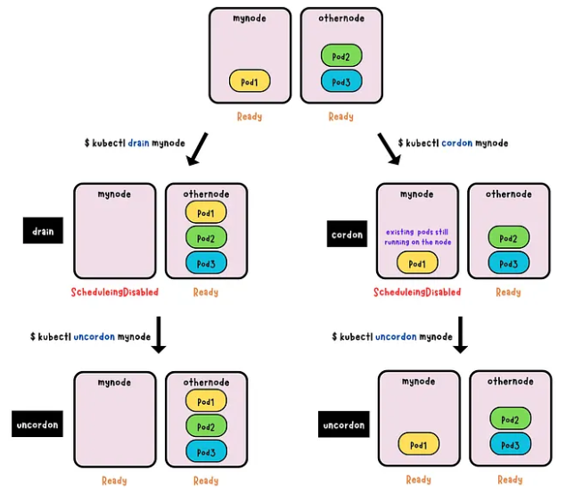
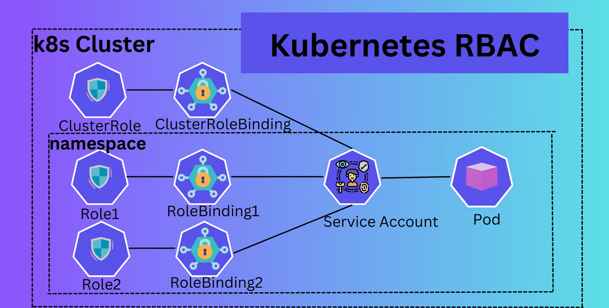
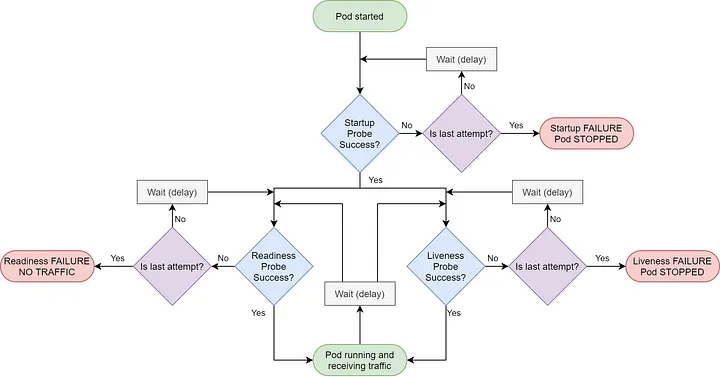

## High Availability (HA) 

* refers to the design and implementation of a cluster to ensure continuous operation and minimize downtime even in the event of component failures.


### 1. Stacked etcd topology


* distributed data storage cluster provided by etcd is stacked on top of the cluster formed by the nodes managed by kubeadm that run control plane components.

* each `control plane node` runs an instance of the `kube-apiserver`, `kube-scheduler`, and `kube-controller-manager`. The `kube-apiserver` is `exposed to worker nodes using a load balancer`.

* Each `control plane node` creates a `local etcd member` and this `etcd member` communicates `only` with the `kube-apiserver`

    > _If one node goes down, both an etcd member and a control plane instance are lost, and redundancy is compromised_ we can mitigate this risk by adding more control plane nodes.


### 2. External etcd topology


* the distributed data storage cluster provided by etcd is external to the cluster formed by the nodes that run control plane components.

* each `control plane node` in an `external etcd topology` runs an instance of the `kube-apiserver`, `kube-scheduler`, and `kube-controller-manager`. And the `kube-apiserver` is `exposed to worker nodes` using a `load balancer`.

* each `etcd host` communicates with the `kube-apiserver` of each `control plane node`.

* losing a `control plane instance` or an `etcd member` has `less impact` and `does not affect the cluster redundancy` as much as the stacked HA topology.

* requires `twice the number of hosts` as the `stacked HA topology`


## Tools

1. kubectl : the offical cli tool 

2. minikube : used to create the k8s cluster in single node

3. kubadm : used to create the cluster , for production level

4. Helm : used to create k8s template, package mangement and convert k8s objects into usable templates

5. kompose : help to transfer docker-compose files into k8s objects 

6. kustomize : configuration management for k8s objects


## Manage Cluster

1. Drain Nodes

* Evicts all pods 'non-daemonset pods' from a node  and then marks the node as "unschedulable" This prevents new pods from being scheduled onto that node

* used to perform maintenance that requires the node to be completely free of workloads, such as OS upgrades, hardware replacement, or kernel patching.

* `kubectl drain <node-name> --ignore-daemonsets --delete-emptydir-data --force  --grace-period=0`

    `--ignore-daemonsets` : DaemonSet-managed pods are not evicted.
    `--delete-emptydir-data` : Deletes pods with emptyDir volumes (temporary storage).
    `--force` and `--grace-period=0` to forcibly evict pods.

2. Cordon Nodes

* Marks a node as "unschedulable" This prevents new pods from being scheduled onto that node.

* Existing pods remain unaffected.

* used to prevent new workloads from landing on a node that might be undergoing preparation for maintenance

* `kubectl cordon <node-name>`


3. Uncordon Node

* Allow schedualing to the node again, node will accept new pods.

* `kubectl uncordon <node-name>`





4. [Upgrade Cluster Instructions](./Instructions/k8s_cluster_upgrade.txt)

* Control Node :
    1. drain worker node
    2. upgrade kubeadm 
    3. Verify the upgrade plan
    4. Apply the Upgrade
    5. upgrade kubelet config
    6. restart kubelet
    7. uncordon the node

* Worker Node :
    1. drain worker node
    2. upgrade kubeadm 
    3. upgrade kubelet config
    4. restart kubelet
    5. uncordon the node


## Role Based Access Control (RBAC)

* [doc-link](https://kubernetes.io/docs/reference/access-authn-authz/rbac/)

* uses the `rbac.authorization.k8s.io` API group 

*  security mechanism that regulates access to Kubernetes API resources

* types of RBAC objects

    1. __Roles__ : define a set of permissions within a specific namespace.

```yaml
apiVersion: rbac.authorization.k8s.io/v1
kind: Role
metadata:
  namespace: default
  name: pod-reader
rules:
- apiGroups: [""] # "" indicates the core API group
  resources: ["pods", "pods/log"]   # for all resources we can use ["*"]
  verbs: ["get", "watch", "list"]   # ["*"]

```

2. __ClusterRoles__ : define the permissions accross the cluster

```yaml
apiVersion: rbac.authorization.k8s.io/v1
kind: ClusterRole
metadata:
  # "namespace" omitted since ClusterRoles are not namespaced
  name: secret-reader
rules:
- apiGroups: [""]
  #
  # at the HTTP level, the name of the resource for accessing Secret
  # objects is "secrets"
  resources: ["secrets"]
  verbs: ["get", "watch", "list"]

```

3. __RoleBindings__ : associates a Role with a user, group, or service account within a specific namespace

```yaml
apiVersion: rbac.authorization.k8s.io/v1
# This role binding allows "jane" to read pods in the "default" namespace.
# You need to already have a Role named "pod-reader" in that namespace.
kind: RoleBinding
metadata:
  name: read-pods
  namespace: default
subjects:
# You can specify more than one "subject"
- kind: User
  name: jane # "name" is case sensitive
  apiGroup: rbac.authorization.k8s.io
roleRef:
  # "roleRef" specifies the binding to a Role / ClusterRole, This kind of reference lets you define a set of common roles across your cluster, then reuse them within multiple namespaces.
  kind: Role #this must be Role or ClusterRole
  name: pod-reader # this must match the name of the Role or ClusterRole you wish to bind to
  apiGroup: rbac.authorization.k8s.io

```

4. __ClusterRoleBinding__ : associates a ClusterRole with a user, group, or service account across the cluster

```yaml
apiVersion: rbac.authorization.k8s.io/v1
# This cluster role binding allows anyone in the "manager" group to read secrets in any namespace.
kind: ClusterRoleBinding
metadata:
  name: read-secrets-global
subjects:
- kind: Group
  name: manager # Name is case sensitive
  apiGroup: rbac.authorization.k8s.io
roleRef:
  kind: ClusterRole         
  name: secret-reader
  apiGroup: rbac.authorization.k8s.io

```

* __`roleRef` is immutable__

    * After creating the binding, we cannot change the Role or ClusterRole that it refers to. 

    * To change the referenced role, you must delete the old binding and create a new one.

    * it prevents users from accidentally or maliciously changing a user's permissions.


### Aggregated ClusterRoles 

* merges permissions from multiple ClusterRoles into a single, larger role using labels

* avoid edit the main ClusterRole

```yaml
apiVersion: rbac.authorization.k8s.io/v1
kind: ClusterRole
metadata:
  name: monitoring
aggregationRule:
  clusterRoleSelectors:
  - matchLabels:
      rbac.example.com/aggregate-to-monitoring: "true"
rules: [] # The control plane automatically fills in the rules

---

apiVersion: rbac.authorization.k8s.io/v1
kind: ClusterRole
metadata:
  name: aggregate-cron-tabs-edit
  labels:
    # Add these permissions to the "admin" and "edit" default roles.
    rbac.authorization.k8s.io/aggregate-to-admin: "true"
    rbac.authorization.k8s.io/aggregate-to-edit: "true"
rules:
- apiGroups: ["stable.example.com"]
  resources: ["crontabs"]
  verbs: ["get", "list", "watch", "create", "update", "patch", "delete"]

---

kind: ClusterRole
apiVersion: rbac.authorization.k8s.io/v1
metadata:
  name: aggregate-cron-tabs-view
  labels:
    # Add these permissions to the "view" default role.
    rbac.authorization.k8s.io/aggregate-to-view: "true"
rules:
- apiGroups: ["stable.example.com"]
  resources: ["crontabs"]
  verbs: ["get", "list", "watch"]
```

### ServiceAccount

* used by the container process to authenticate  with the K8S API 

* Kubernetes automatically assigns the ServiceAccount named default in default namespace.

```yaml
apiVersion: v1
kind: ServiceAccount
metadata:
  name: build-robot
automountServiceAccountToken: false
```




## Application Configuration

* k8s allow pass dynamic configuration values at the application runtime which control its workflow


### ConfiMap

* used to assign non-sensitive configuration

* key value format

* data stored in a ConfigMap cannot exceed 1 MiB

```yaml
apiVersion: v1
kind: ConfigMap
metadata:
  name: game-demo
data:

  # property-like keys; each key maps to a simple value
  player_initial_lives: "3"
  ui_properties_file_name: "user-interface.properties"

  # file-like keys
  game.properties: |
    enemy.types=aliens,monsters
    player.maximum-lives=5    
  user-interface.properties: |
    color.good=purple
    color.bad=yellow
    allow.textmode=true

immutable: true  # set the configmap immutable
```


* ways to use ConfigMap in the pod containers

    * Inside a container command and args
    * Environment variables for a container
    * Add a file in read-only volume, for the application to read
    * Write code to run inside the Pod that uses the Kubernetes API to read a ConfigMap

```yaml
apiVersion: v1
kind: Pod
metadata:
  name: configmap-demo-pod
spec:
  containers:
    - name: demo
      image: alpine
      command: ["sleep", "3600"]
      env:
        # Define the environment variable
        - name: PLAYER_INITIAL_LIVES # Notice that the case is different here
                                     # from the key name in the ConfigMap.
          valueFrom:
            configMapKeyRef:
              name: game-demo           # name of the  ConfigMap 
              key: player_initial_lives # The key to fetch.
        - name: UI_PROPERTIES_FILE_NAME
          valueFrom:
            configMapKeyRef:
              name: game-demo
              key: ui_properties_file_name

      # or use this 

      #envFrom:
      #  - configMapRef:
      #      name: myconfigmap    # name of the configmap


      volumeMounts:
      - name: config
        mountPath: "/config"  # inside the container
        readOnly: true
        # defaultMode: 0444 # Read-only permissions for owner, group, and others
  volumes:
  # You set volumes at the Pod level, then mount them into containers inside that Pod
  - name: config
    configMap:
      # Provide the name of the ConfigMap you want to mount.
      name: game-demo
      # An array of keys from the ConfigMap to create as files
      items:
      - key: "game.properties"
        path: "game.properties"
      - key: "user-interface.properties"
        path: "user-interface.properties"
        
```

### Secret

* used to configure the sensitive data

* key value format

* command to encrypt a text `echo -n "some-text" | base64 `

* [types of secrets](https://kubernetes.io/docs/concepts/configuration/secret/#secret-types)

  * Opaque  : default Secret type

    we must use `kubectl create secret generic <...>`


```yaml
apiVersion: v1
kind: Secret
metadata:
  name: dotfile-secret
data:
  .secret-file: dmFsdWUtMg0KDQo=
type: Opaque

---
apiVersion: v1
kind: Pod
metadata:
  name: secret-dotfiles-pod
spec:
  volumes:
    - name: secret-volume
      secret:
        secretName: dotfile-secret
  containers:
    - name: dotfile-test-container
      image: registry.k8s.io/busybox
      command:
        - ls
        - "-l"
        - "/etc/secret-volume"
      volumeMounts:
        - name: secret-volume
          readOnly: true
          mountPath: "/etc/secret-volume"
```
## Storage

### Volume

  * provide a way for containers in a pod to access and share data via the filesystem

  * important for data persistence and shared storage

* types

1. ConfigMap

  * inject configuration data into pods

  * data stored in a ConfigMap can be referenced using this volume type

```yaml
apiVersion: v1
kind: Pod
metadata:
  name: configmap-pod
spec:
  containers:
    - name: test
      image: busybox:1.28
      command: ['sh', '-c', 'echo "The app is running!" && tail -f /dev/null']
      volumeMounts:
        - name: config-vol   # name of the volume
          mountPath: /etc/config  # path in the container
  volumes:
    - name: config-vol   # name of the volume
      configMap:          # type of the volume  always mounted as readOnly
        name: log-config   # name of the configMap
        items:              # may share some items from the configMap 
          - key: log_level
            path: log_level.conf
```

2. emptyDir

  * created when the Pod is assigned to a node

  * all containers in the Pod can read and write the same files in the emptyDir volume

  * can be mounted at the same or different paths in each container

  * if pod removed the volume removed but when container removed has no affect on the volume

  * by default are stored on whatever medium that backs the node such as disk, SSD, or network storage, depending on your environment
  * used for Sharing Data Between Containers, Temporary File Storage, High-Speed In-Memory Storage when assign `medium: "Memory"`

```yaml

spec:
  containers:
  - image: registry.k8s.io/test-webserver
    name: test-container
    volumeMounts:
    - mountPath: /cache
      name: cache-volume
  volumes:
  - name: cache-volume
    emptyDir:
      sizeLimit: 500Mi
      medium: Memory   # memory storage

```

3. hostPath

  * mounts a file or directory from the host node's filesystem into the Pod

  * presents many security risks. insted it use `local persistence volume`

  * uses 

    * running a container that needs access to node-level system components such as reading logs 

    * making a configuration file stored on the host system available read-only to a static pod as it can not access configMap


```yaml
 volumeMounts:
    - mountPath: /foo
      name: example-volume
      readOnly: true        # restict the access that is for more security
  volumes:
  - name: example-volume
    # mount /data/foo, but only if that directory already exists
    hostPath:
      path: /data/foo # directory location on host
      type: Directory # this field is optional default is "" means no checks will be performed before mounting the hostPath volume
```

  * hostPath type

    1. `""` it is the default value which means no checks will be performed befor mounting the hostPath volume

    2. `DirectoryOrCreate` if the path not exist then it will be created with permissions `0755`

    3. `Directory` directory must exist at the given path

    4. `FileOrCreate` If nothing exists at the path, an empty file is created with permissions 0644`, If the parent directory of the mounted file does not exist, the pod fails to start

    5. `File` A file must already exist at the given path.

    6. `Socket` A UNIX socket must already exist at the given path.

    7. `CharDevice` A character device must exist at the path (Linux nodes only).

    8. `BlockDevice`  A block device must exist at the path (Linux nodes only).


4. other types

  * `gitRepo` mounts a git repo as a volume

  * `image` mounts an OCI object (a container image or artifact) that is available on the kubelet's host machine

  * `nfs` mounts an existing NFS (Network File System) share. Data is preserved, and it can be mounted by multiple writers simultaneously.

  * `local` used when creating `PresistenceVolume`, It requires nodeAffinity to be set on the PersistentVolume so the scheduler can place the Pod on the correct node. 

  * `persistentVolumeClaim`  Used to mount a `PersistentVolume` into a Pod, allowing users to claim durable storage without knowing the details of the particular cloud environment.

  * `secret` used to pass sensitive information, such as passwords, to Pods. mounted as `readOnly`

```yaml

volumes:
  - name: git-volume
    gitRepo:
      repository: "git@somewhere:me/my-git-repository.git"
      revision: "22f1d8406d464b0c0874075539c1f2e96c253775"
---

volumes:
  - name: volume
    image:
      reference: quay.io/crio/artifact:v2  # Artifact reference
      pullPolicy: IfNotPresent
---
volumes:
  - name: test-volume
    nfs:
      server: my-nfs-server.example.com
      path: /my-nfs-volume
      readOnly: true
```

### PersistenceVolume (PV)

  * provides details of how storage is provided from how it is consume

  * piece of storage in the cluster that has been `provisioned` by an `administrator` or `dynamically` provisioned using `Storage Classes`


#### PV provisioning

1. Static

  * cluster administrator creates a number of PVs

  * PVs are available in the API for users to claim.

2. Dynamic

  * using `StorageClass`

#### PV Binding

  * control loop in the control plane watches for new PVCs, finds a matching PV, and binds them together. if `PV` dynamicaly provisioned, loop always bind that PV to the PVC

#### Storage Object in use Protection

  * prevents data loss by stopping the deletion of PVCs or PVs that are actively in use.

  * protection is managed using `finalizers` (e.g., kubernetes.io/pvc-protection). ensures that PVs with a `Delete` policy are only removed after the backing storage has been successfully deleted.

  
#### Reclaiming

  * define the affect of PV after deleting the PVC

  1. `Retain` 

  * PV and its data remains after deleting PVC

  * Volume is `released` and require manual cleanup


  2. `Delete`

  * default for dynamic provisioning

  * deletes both the PV object and the associated storage asset in the external infrastructure.

  3. `Recycle (deprecated)`

  * performs a basic scrub (rm -rf /thevolume/*) on the volume. and makes it available again for a new claim.

#### PV Types

[Types of Persistent Volumes](https://kubernetes.io/docs/concepts/storage/persistent-volumes/#types-of-persistent-volumes)

#### Access Modes

1. `ReadWriteOnce` volume can be mounted as read-write by a single node, allow multiple pods in the same node to access the volume at the same time

2. `ReadOnlyMany` volume can be mounted as read-only by many nodes.

3. `ReadWriteMany` volume can be mounted as read-write by many nodes.

4. `ReadWriteOncePod`  volume can be mounted as read-write by a single Pod


```yaml
apiVersion: v1
kind: PersistentVolume
metadata:
  name: my-pv-volume
spec:
  capacity:
    storage: 1Gi
  volumeMode: Filesystem  # by default is Filesystem, mounted into Pods into a directory 
                         # another mode is  `Block` volume is presented into a Pod as a block device without any filesystem on it
  accessModes:
    - ReadWriteOnce
  persistentVolumeReclaimPolicy: Retain
  storageClassName: manual
  # The actual storage details vary based on the storage type (e.g., nfs, awsEbs, azureDisk)
  nfs:
    path: /mnt/nfs/data
    server: 192.168.1.100
```


#### PV Phase

1. `Available` : The volume is free and not currently bound to any claim.

2. `Bound` : The volume is actively bound to a PersistentVolumeClaim (PVC).

3. `Released` : The associated PVC has been deleted, but the cluster has not yet reclaimed the storage resource.

4. `Failed` : The volume's automated reclamation process has failed.


### PersistentVolumeClaim (PVC) 

  * it is a request for storage by a user.

  * Pods consume node resources and PVCs consume PV resources

  * `Pods` can request specific levels of resources (CPU and Memory). `Claims` can request specific `size` and `access modes`

  * Pods access storage by mounting the PVC as a volume. The Pod and the PVC must exist in the same namespace.

  * only expand a `PVC` if its `storage class`'s `allowVolumeExpansion` field is set to `true`.

```yaml
apiVersion: v1
kind: PersistentVolumeClaim
metadata:
  name: myclaim
spec:
  accessModes:
    - ReadWriteOnce
  volumeMode: Filesystem
  resources:
    requests:
      storage: 8Gi
  storageClassName: slow    # Bound with pv if has the same storage class name, PVCs don't necessarily have to request a class, set it ""  bound only to PVs of that default storageClass
  selector:       # volumes whose labels match the selector can be bound to the claim
    matchLabels:
      release: "stable"
    matchExpressions:
      - {key: environment, operator: In, values: [dev]}

---

# PVC from volume snapshot
spec:
  storageClassName: csi-hostpath-sc
  dataSource:
    name: new-snapshot-test
    kind: VolumeSnapshot
    apiGroup: snapshot.storage.k8s.io
  accessModes:
    - ReadWriteOnce
  resources:
    requests:
      storage: 10Gi

---
# Clone a PVC

spec:
  storageClassName: my-csi-plugin
  dataSource:
    name: existing-src-pvc-name
    kind: PersistentVolumeClaim
```

### Storage Class

* define the type of the storage service

* primary mechanism for `dynamic provisioning`, which automatically creates a PersistentVolume (PV) when a PersistentVolumeClaim (PVC) requests a specific class

* `provisioner` that determines what `volume plugin` is used for provisioning PVs

* `parameters` describe the storage (e.g., disk type, filesystem, or encryption settings)


```yaml
apiVersion: storage.k8s.io/v1
kind: StorageClass
metadata:
  name: low-latency
  annotations:
    storageclass.kubernetes.io/is-default-class: "false"
provisioner: csi-driver.example-vendor.example
reclaimPolicy: Retain # default value is Delete
allowVolumeExpansion: true
mountOptions:
  - discard # this might enable UNMAP / TRIM at the block storage layer
volumeBindingMode: WaitForFirstConsumer             # `Immediate` mode indicates that volume binding and dynamic provisioning occurs once the PersistentVolumeClaim is created
parameters:                                   # describe the storage (e.g., disk type, filesystem, or encryption settings)
  guaranteedReadWriteLatency: "true" # provider-specific

allowedTopologies:      # Used with `WaitForFirstConsumer` to restrict the provisioning of volumes to specific topologies (e.g., only in us-central-1a or us-central-1b).
- matchLabelExpressions:
  - key: topology.kubernetes.io/zone
    values:
    - us-central-1a
    - us-central-1b
```

#### Provisioner

* `Internal Provisioners`: Legacy in-tree provisioners (e.g., kubernetes.io/vsphere-volume). Many of these, including those for AWS EBS and Azure Disk, are deprecated.

* `External Provisioners`: The recommended approach. These are independent programs that follow the `Container Storage Interface (CSI)` specification (e.g., ebs.csi.aws.com, efs.csi.aws.com).

* `Local Storage`: A special case that uses `kubernetes.io/no-provisioner`. It doesn't dynamically provision new storage but uses `WaitForFirstConsumer` to delay binding until a Pod is scheduled, allowing the Pod to be matched with a pre-existing local PV on a specific node.


## Pods

### Containers Resources (cpu & memory)

* Resource Request

  * request amount of that system resource specifically for that container to use

  * `kube-scheduler` uses this information to decide which node to place the Pod

* Resource Limt

  * `kubelet` enforces those limits so that the running container is not allowed to use more of that resource than the limit you set

```yaml
apiVersion: v1
kind: Pod
metadata:
  name: frontend
spec:
# we can assign resources for the pod and its container
  resources:
    limits:
      cpu: "1"
      memory: "200Mi"
    requests:
      cpu: "1"
      memory: "100Mi"

  containers:
  - name: log-aggregator
    image: images.my-company.example/log-aggregator:v6
    resources:
      requests:
        memory: "64Mi"
        cpu: "250m"   # m is millicpu or millicores
      limits:
        memory: "128Mi"
        cpu: "500m"
```

### Container HealthCheck

1. Liveness probes 

* determine when to restart a container

* if a container fails its liveness probe repeatedly, the kubelet restarts the container.

* do not wait for readiness probes to succeed, we can use startup probe in this case


2. Readiness probes

* determine when a container is ready to accept traffic, end-end healthcheck lifecycle

* used when the app establishing network connections, loading files, and warming caches

* run on the container during its whole lifecycle

3. startup probe

* verifies whether the application within a container is started.

* if configured, it disables liveness and readiness checks until it succeeds.





> we can define the probes using

  * command in the container 

  * HTTP request

  * [TCP socket](https://kubernetes.io/docs/tasks/configure-pod-container/configure-liveness-readiness-startup-probes/#define-a-tcp-liveness-probe)

  * [gRPC](https://kubernetes.io/docs/tasks/configure-pod-container/configure-liveness-readiness-startup-probes/#define-a-grpc-liveness-probe)


4. _examples_

* 
```yaml
#....

spec:
  containers:
  - name: liveness
    image: registry.k8s.io/busybox:1.27.2
    args:
    - /bin/sh
    - -c
    - touch /tmp/healthy; sleep 30; rm -f /tmp/healthy; sleep 600
    livenessProbe:
      exec:
        command:
        - cat
        - /tmp/healthy
      initialDelaySeconds: 5   # tells kubelet that it should wait 5 seconds before performing the first probe
      periodSeconds: 5         # kubelet should perform a liveness probe every 5 seconds

---

#....

spec:
  containers:
  - name: liveness
    image: registry.k8s.io/e2e-test-images/agnhost:2.40
    args:
    - liveness
    livenessProbe:
      httpGet:
        path: /healthz
        port: 8080
        httpHeaders:
        - name: Custom-Header
          value: Awesome
      initialDelaySeconds: 3
      periodSeconds: 3

```

* 
```yaml
#....
ports:
- name: liveness-port
  containerPort: 8080

startupProbe:
  httpGet:
    path: /healthz
    port: liveness-port
  failureThreshold: 30    # the application will have a maximum of 5 minutes (30 * 10 = 300s) to finish its startup, If the startup probe never succeeds, the container is killed after 300s, then restart the pod.
  periodSeconds: 10
```

* 
```yaml

readinessProbe:
  exec:
    command:
    - cat
    - /tmp/healthy
  initialDelaySeconds: 5
  periodSeconds: 5
```


* configure the probes doc

> [doc](https://kubernetes.io/docs/tasks/configure-pod-container/configure-liveness-readiness-startup-probes/#configure-probes)


### Restart Policies

* k8s has the abaility to restart the container when it fails


1. Always

  * default policy

  * even if run successfully

2. OnFailuer

  * only when container process exit with error code

  * when liveness probe detect that the container is unhealthy

3. Never

  * conatiner never restart even liveness probe detect that the container unhealthy 


```yaml

#...
spec:
  restartPolicy: OnFailure   # restart policy for the pod

  containers:

  - name: try-once-container    # This container will run only once because the restartPolicy is Never.
    image: docker.io/library/busybox:1.28
    command: ['sh', '-c', 'echo "Only running once" && sleep 10 && exit 1']
    restartPolicy: Never     # restart policy for the container

  - name: on-failure-container  # This container will be restarted on failure.
    image: docker.io/library/busybox:1.28
    command: ['sh', '-c', 'echo "Keep restarting" && sleep 1800 && exit 1']
```


### SideCar Container

* are the secondary containers that run along with the main application container within the same Pod

* remain running after Pod startup

* have their own independent lifecycles

* support probes to control their lifecycle.

* Shares the same network and storage as the main app.

*  used to enhance or to extend the functionality of the primary app container by providing additional services, or functionality such as logging, monitoring, security, or data synchronization, without directly altering the primary application code.


```yaml
spec:
      containers:
        - name: myapp
          image: alpine:latest
          command: ['sh', '-c', 'while true; do echo "logging" >> /opt/logs.txt; sleep 1; done']
          volumeMounts:
            - name: data
              mountPath: /opt
      initContainers:
        - name: logshipper
          image: alpine:latest
          restartPolicy: Always
          command: ['sh', '-c', 'tail -F /opt/logs.txt']
          volumeMounts:
            - name: data
              mountPath: /opt
      volumes:
        - name: data
          emptyDir: {}
```


### Init Container

* run before the app containers are started.

* always run to completion

* Pod cannot be Ready until all init containers have succeeded

* Shares the same network and storage as the main app.

* Do not support lifecycle, livenessProbe, readinessProbe, or startupProbe.


```yaml
spec:
  containers:
  - name: myapp-container
    image: busybox:1.28
    command: ['sh', '-c', 'echo The app is running! && sleep 3600']
  initContainers:
  - name: init-myservice
    image: busybox:1.28
    command: ['sh', '-c', "until nslookup myservice.$(cat /var/run/secrets/kubernetes.io/serviceaccount/namespace).svc.cluster.local; do echo waiting for myservice; sleep 2; done"]
  - name: init-mydb
    image: busybox:1.28
    command: ['sh', '-c', "until nslookup mydb.$(cat /var/run/secrets/kubernetes.io/serviceaccount/namespace).svc.cluster.local; do echo waiting for mydb; sleep 2; done"]
```

### Scheduling Pods


1. using `nodeSelector`and `nodeName`

```yaml
apiVersion: v1
kind: Pod
metadata:
  name: nginx
  labels:
    env: test
spec:
  containers:
  - name: nginx
    image: nginx
    imagePullPolicy: IfNotPresent
  nodeSelector:       #best practice
    disktype: ssd

  #nodeName: foo-node

```

>  * add label to node   

  `kubectl label nodes <your-node-name> disktype=ssd`

  `kubectl get nodes --show-labels`

2. using Affinity and anti-affinity

* Node affinity functions like the nodeSelector field but is more expressive and allows you to specify `soft rules`

  * two types of node affinity:

    * `requiredDuringSchedulingIgnoredDuringExecution` : Pod won't be scheduled unless the rule is met

    * `preferredDuringSchedulingIgnoredDuringExecution` : scheduler tries to meet the rule but will schedule the Pod elsewhere if no matching Node is found. Preferred rules can be given a `weight (1-100)`


```yaml
apiVersion: v1
kind: Pod
metadata:
  name: with-node-affinity
spec:
  affinity:
    nodeAffinity:
      requiredDuringSchedulingIgnoredDuringExecution:           # required during scheduling pod must pass the conditions
                                                                #  ignore during execution pod still run if label change 
        nodeSelectorTerms:
        - matchExpressions:
          - key: topology.kubernetes.io/zone
            operator: In
            values:
            - antarctica-east1
            - antarctica-west1
      preferredDuringSchedulingIgnoredDuringExecution:        # preferred during scheduling the pod wil be scheduled if rules not satisfied
                                                                #  ignore during execution pod still run if label change  
      - weight: 1
        preference:
          matchExpressions:
          - key: another-node-label-key
            operator: In
            values:
            - another-node-label-value
  containers:
  - name: with-node-affinity
    image: registry.k8s.io/pause:3.8
```

* Node anti-Affinity

  * pods run on a Node that DOES NOT HAVE this label

  * only change the operatore with add `NotIN` or `DoesNotExist` also `Gt` and `Lt` 
```yaml
affinity:
    nodeAffinity:
      requiredDuringSchedulingIgnoredDuringExecution:
        nodeSelectorTerms:
        - matchExpressions:
          - key: topology.kubernetes.io/zone
            operator: NotIn
            values:
            - antarctica-east1
```

> Operatores

| Operator | Behavior |
|---|---|
| In | The label value is present in the supplied set of strings |
|NotIn|The label value is not contained in the supplied set of strings|
|Exists|A label with this key exists on the object|
|DoesNotExist|No label with this key exists on the object|
|Gt|The field value will be parsed as an integer, and that integer is less than the integer that results from parsing the value of a label named by this selector|
|Lt|The field value will be parsed as an integer, and that integer is greater than the integer that results from parsing the value of a label named by this selector|