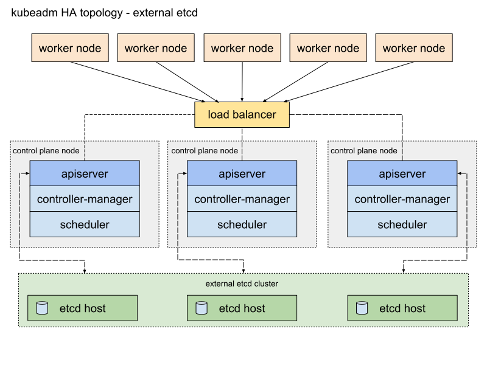

## High Availability (HA) 

* refers to the design and implementation of a cluster to ensure continuous operation and minimize downtime even in the event of component failures.

### 1. Stacked etcd topology

* distributed data storage cluster provided by etcd is stacked on top of the cluster formed by the nodes managed by kubeadm that run control plane components.

* each `control plane node` runs an instance of the `kube-apiserver`, `kube-scheduler`, and `kube-controller-manager`. The `kube-apiserver` is `exposed to worker nodes using a load balancer`.

* Each `control plane node` creates a `local etcd member` and this `etcd member` communicates `only` with the `kube-apiserver`

    > _If one node goes down, both an etcd member and a control plane instance are lost, and redundancy is compromised_ we can mitigate this risk by adding more control plane nodes.

### 2. External etcd topology

* the distributed data storage cluster provided by etcd is external to the cluster formed by the nodes that run control plane components.

* each `control plane node` in an `external etcd topology` runs an instance of the `kube-apiserver`, `kube-scheduler`, and `kube-controller-manager`. And the `kube-apiserver` is `exposed to worker nodes` using a `load balancer`.

* each `etcd host` communicates with the `kube-apiserver` of each `control plane node`.

* losing a `control plane instance` or an `etcd member` has `less impact` and `does not affect the cluster redundancy` as much as the stacked HA topology.

* requires `twice the number of hosts` as the `stacked HA topology`

## Tools

1. kubectl : the offical cli tool 

2. minikube : used to create the k8s cluster in single node

3. kubadm : used to create the cluster , for production level

4. Helm : used to create k8s template, package mangement and convert k8s objects into usable templates

5. kompose : help to transfer docker-compose files into k8s objects 

6. kustomize : configuration management for k8s objects

## Manage Cluster

1. Drain Nodes

* Evicts all pods 'non-daemonset pods' from a node  and then marks the node as "unschedulable" This prevents new pods from being scheduled onto that node

* used to perform maintenance that requires the node to be completely free of workloads, such as OS upgrades, hardware replacement, or kernel patching.

* `kubectl drain <node-name> --ignore-daemonsets --delete-emptydir-data --force  --grace-period=0`

    `--ignore-daemonsets` : DaemonSet-managed pods are not evicted.
    `--delete-emptydir-data` : Deletes pods with emptyDir volumes (temporary storage).
    `--force` and `--grace-period=0` to forcibly evict pods.

2. Cordon Nodes

* Marks a node as "unschedulable" This prevents new pods from being scheduled onto that node.

* Existing pods remain unaffected.

* used to prevent new workloads from landing on a node that might be undergoing preparation for maintenance

* `kubectl cordon <node-name>`

3. Uncordon Node

* Allow schedualing to the node again, node will accept new pods.

* `kubectl uncordon <node-name>`

4. 