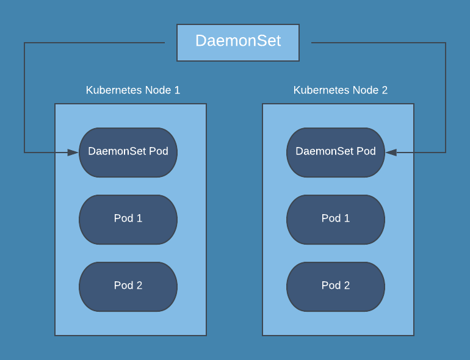
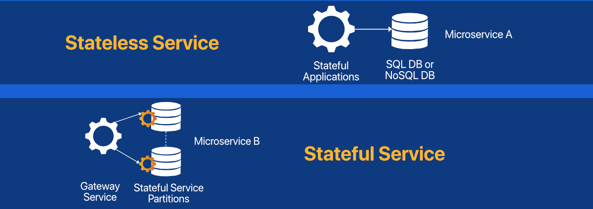
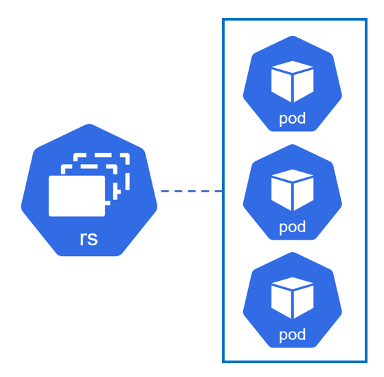
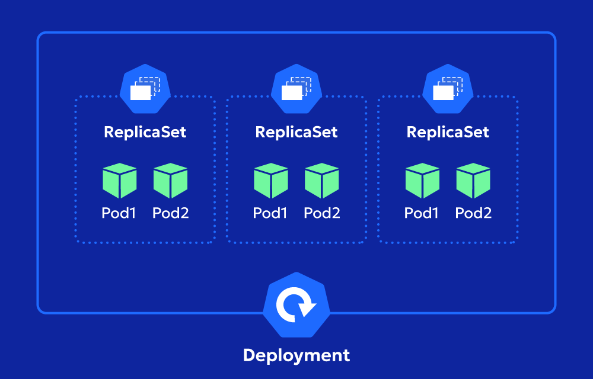
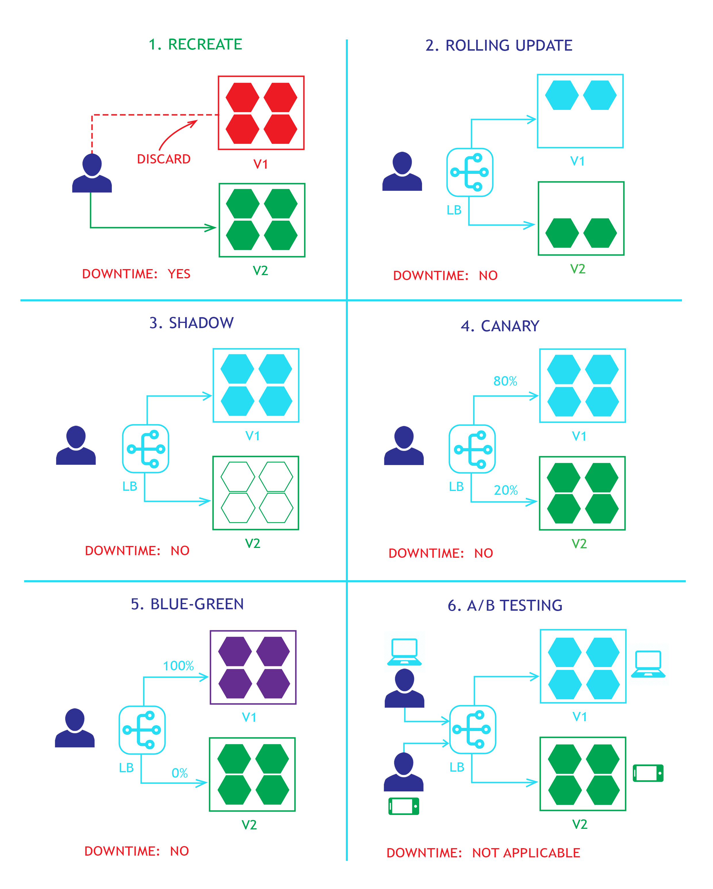

## DaemonSets



* Run a Copy of the Pod on each cluster node

* best pratctice to use in `monitoring, log collection, proxy configuration`

```yaml
apiVersion: apps/v1
kind: DaemonSet
metadata:
  name: fluentd-elasticsearch
  namespace: kube-system
  labels:
    k8s-app: fluentd-logging
spec:
  selector:
    matchLabels:
      name: fluentd-elasticsearch
  template:
    metadata:
      labels:
        name: fluentd-elasticsearch
    spec:
      tolerations:
      # these tolerations are to have the daemonset runnable on control plane nodes
      # remove them if your control plane nodes should not run pods
      - key: node-role.kubernetes.io/control-plane
        operator: Exists
        effect: NoSchedule
      - key: node-role.kubernetes.io/master
        operator: Exists
        effect: NoSchedule
      containers:
      - name: fluentd-elasticsearch
        image: quay.io/fluentd_elasticsearch/fluentd:v5.0.1
        resources:
          limits:
            memory: 200Mi
          requests:
            cpu: 100m
            memory: 200Mi
        volumeMounts:
        - name: varlog
          mountPath: /var/log
      # it may be desirable to set a high priority class to ensure that a DaemonSet Pod
      # preempts running Pods
      # priorityClassName: important
      terminationGracePeriodSeconds: 30
      volumes:
      - name: varlog
        hostPath:
          path: /var/log
```

## Static pod

* managed by `kubelet`, API server not required

* `kubelet` automatically tries to create a `mirror Pod` on the Kubernetes API server for each static Pod

* `mirror pod` it is replica of staic pod allow API monitore the static pod

* to create it 

    go to the node where you want to runt the pod

    `/etc/kubernetes/manifests`

    create the pod yaml file

    then reload the `kubelet`  : `systemctl restart kubelet`

    `crictl ps` used to view the running containers

    `crictl stop <container-id>`  stop the running container


```bash
# Run this command on the node where kubelet is running
mkdir -p /etc/kubernetes/manifests/
cat <<EOF >/etc/kubernetes/manifests/static-web.yaml
apiVersion: v1
kind: Pod
metadata:
  name: static-web
  labels:
    role: myrole
spec:
  containers:
    - name: web
      image: nginx
      ports:
        - name: web
          containerPort: 80
          protocol: TCP
EOF
```

## App Scaling

* k8s support automatic scaling

1. Vertical Scaling : scaling up

    * adding more resources (memory,cpu)

2. Horizontal Scaling : scaling out

    * adding more pods,nodes


### Stateless ans Statful

* Stateless app does not save the client data , scalled horizonatly, pods can be replaced or scaled up/down without affecting the application's functionality. managed by k8s `Deployments`

* Stateful app stores the client data, scaled verticaly only because we cant split the file system such as database apps, managed by k8s `StatefulSet`




### ReplicationControlller and ReplicaSet



* ReplicationController : Ensures a specified number of pod replicas are running.

* ReplicaSet : next-generation ReplicationController

* "bare pod" or "standalone pod" refers to a Pod that is created directly without being managed by a higher-level controller like a Deployment, ReplicaSet, Job, or DaemonSet.

```yaml

apiVersion: v1
kind: ReplicationController
metadata:
  name: my-replication-controller
spec:
  replicas: 3
  selector:
    app: my-app
  template:
    metadata:
      labels:
        app: my-app
    spec:
      containers:
        - name: my-container
          image: my-image
---

apiVersion: apps/v1
kind: ReplicaSet
metadata:
  name: my-replicaset
spec:
  replicas: 3
  selector:
    matchExpressions:               # use enchanced selector than rc
      - {key: app, operator: In, values: [my-app]}  # NotIn, values....
  template:
    metadata:
      labels:
        app: my-app
    spec:
      containers:
        - name: my-container
          image: my-image
```

## Deployment



* Deployment provides declarative updates for Pods and ReplicaSets.

* define the desired state in the Deployment specification, and the Deployment Controller automatically changes the actual state to match the desired state at a controlled rate

* uses

    * Rollout a new ReplicaSet to create Pods.

    * Declare a new state (e.g., updating the Pod image) to trigger a gradual scale-up of a new ReplicaSet and scale-down of the old ReplicaSet.

    * Rollback to a previous stable revision.

    * Scale up or down to manage load.

    * Pause and resume rollouts to batch multiple updates.


```yaml

apiVersion: apps/v1
kind: Deployment
metadata:
  name: nginx-deployment
  labels:
    app: nginx    # Deployment's label selector is immutable after it gets created.
spec:
  replicas: 3
  selector:
    matchLabels:
      app: nginx
  template:
    metadata:
      labels:
        app: nginx
    spec:
      containers:
      - name: nginx
        image: nginx:1.14.2
        ports:
        - containerPort: 80
```

* work with deployment   

    * `kubectl set image deployment.v1.apps/nginx-deployment <container-name=new-image>` 

    * `kubectl set image deployment/nginx-deployment <container-name=image-name>`

    * `kubectl edit deployment/nginx-deployment`

    * `kubectl rollout status deployment/nginx-deployment`  : to see the satatus

    * `kubectl rollout history deployment/nginx-deployment`  : check the history

    * `kubectl rollout history deployment/nginx-deployment --revision=2` : see the previous revision number 2

    * `kubectl rollout undo deployment/nginx-deployment`  : rollback to previous revision

    * `kubectl rollout undo deployment/nginx-deployment --to-revision=2`  : rollback to previous revision

    * `kubectl scale deployment/nginx-deployment --replicas=10` scale the deployment

    * `kubectl autoscale deployment/nginx-deployment --min=10 --max=15 --cpu-percent=80`  scale the deployment if `HPA` is enabled

    * `kubectl rollout pause deployment/nginx-deployment`  pause the update

    * `kubectl rollout resume deployment/nginx-deployment`  resume the update

    * `kubectl set resources deployment/nginx-deployment -c=nginx --limits=cpu=200m,memory=512Mi`  update the resources


* updating the deployment process

    * create new replicaset
    * scale up the new replicaset
    * scale down the old replicaset

* failed dwployment 

    * insufficient quota
    * Readiness probe failures
    * Image pull errors
    * Insufficient permissions
    * Limit ranges
    * Application runtime misconfiguration

### Deployment Strategy



1. Recreate Deployment

    * down all pods and recreate a new version of them again

    * good at testing and development environment

```yaml
apiVersion: apps/v1
kind: Deployment
metadata:
  name: my-app-recreate
spec:
  replicas: 3
  strategy:
    type: Recreate # strategy type
  template:
    metadata:
      labels:
        app: my-app
    spec:
      containers:
      - name: my-container
        image: my-app:v2 # Change to :v3 for the update
```

2. Rolling Update

    * default strategy

    * update pod one by one

    * low downtime, easy to roll back to the previous version.

```yaml
apiVersion: apps/v1
kind: Deployment
metadata:
  name: my-app-rolling
spec:
  replicas: 4
  strategy:
    type: RollingUpdate # This is the default, can be omitted
    rollingUpdate:
      maxUnavailable: 25% # Max 1 pod unavailable at any time (1/4 of 4 replicas) , can be number or percentage
      maxSurge: 1 # Max 1 extra pod allowed during the update (total pods: 4+1=5), Pods that can be created over the desired number of replicas
  template:
    # ... Pod template definition with image: my-app:v2 ...
```

3. Blue/Green 

    * two environments side-by-side 

    * blue it is current version

    * green it is the new version

    * cons : Double the resource consumption

    * used when new version may have a risk and rapid rollback is required 

```yaml
# Deployment 'blue-app-v1'
spec:
  selector:
    matchLabels:
      app: my-app
      version: v1 # Blue version label
# ... container image: my-app:v1

---

# Deployment 'green-app-v2'
spec:
  selector:
    matchLabels:
      app: my-app
      version: v2 # Green version label
# ... container image: my-app:v2

---
# to change the traffic from blue to green change the version
apiVersion: v1
kind: Service
metadata:
  name: my-app-service
spec:
  selector:
    app: my-app
    version: v1 # <--- Currently routes to Blue (v1)
  ports:
  - port: 80
# ...
```

4. Canary

    * partial update process

    * allow test the new version on real users without commitment the full rollout

    * Highly risk-mitigating as issues only affect a small user group

5. A/B Testing

    * Multiple versions are concurrently tested on different users to compare performance or user experience.