# K8s Networking

* The network plugin is configured to assign IP addresses to Pods.
* The kube-apiserver is configured to assign IP addresses to Services.
* The kubelet or the cloud-controller-manager is configured to assign IP addresses to Nodes.

## Container Network Interface (CNI) 

* provide network connectivity to Kubernetes Pods, enabling communication both within a node and across nodes in the cluster.

* When a Pod is created, the CNI plugin creates and configures virtual network interfaces within the Pod's network namespace

* CNI plugins assign unique IP addresses to Pods from a configured IP address pool, ensuring that each Pod has a routable address.

* configure routing rules, firewall rules, and other network settings to facilitate communication between Pods, and between Pods and external services.

> [__plugins examples__](https://kubernetes.io/docs/concepts/cluster-administration/addons/#networking-and-network-policy)

* Flannel: A simple and lightweight CNI plugin often used for basic overlay networking.

* Calico: Offers advanced network policy enforcement and supports various networking modes.

* Cilium: Leverages eBPF for high-performance networking, security, and observability.

* Weave Net: Provides a simple and resilient overlay network for containers.


## DNS

* k8s creates DNS records for Services and Pods

* DNS queries may be expanded using the Pod's `/etc/resolv.conf`. kubelet configures this file for each Pod

### DNS Records

1. Services

* Normal Services (with a Cluster IP)

    * `A` record (or `AAAA` for IPv6) that points to the Service's stable `Cluster IP`.

    * The Name Format: `my-svc.my-namespace.svc.cluster-domain.example` such as `web-app.production.svc.cluster.local`


* Headless Services (without a Cluster IP)

    * `A` record (or `AAAA`) that resolves to the IP addresses of `ALL the Pods` that the Service selects

    * name format : `my-svc.my-namespace.svc.cluster-domain.example`  resolve to the IP of every Pod running the application

* SRV Records (Service Records)

    * provide information about the port and protocol of a named service port.

    * format : `_port-name._port-protocol.my-svc.my-namespace.svc.cluster-domain.example`

2. Pods

* Default Pod Naming (Older Format)

    * `<pod-IPv4-address-with-dashes>.<namespace>.pod.<cluster-domain>`

* Custom Hostname and Subdomain (For specific Naming)

    * give it a special subdomain to create a specific, resolvable Fully Qualified Domain Name (FQDN). commonly used for stateful applications

    * `spec.hostname` 

    * `spec.subdomain` work with Headless Service

    * `<hostname>.<subdomain>.<namespace>.svc.cluster-domain.example`

    * `setHostnameAsFQDN: true` : maked the full FQDN (the long name) be returned as the hostname inside the Pod, instead of just the short hostname.


#### Pod DNS policy  (`dnsPolicy`)

* `ClusterFirst` (Default)	Tries to resolve names inside the cluster first (like web-app.production), then forwards external queries (like www.google.com) to the node's upstream DNS.	Used by default if no policy is set.

* `Default`	The Pod inherits the DNS settings directly from the node it's running on.	When you need the Pod to use the host's DNS setup.

* `ClusterFirstWithHostNet`	Same as `ClusterFirst`, but used specifically for Pods with `hostNetwork: true`.

* `None` Completely `ignores` the `Kubernetes-generated DNS settings`. Requires you to `manually specify all settings` using `dnsConfig`. When you need complete, custom control over the Pod's DNS.

#### DNS Config (`dnsConfig`)

* allows fine-grained customization of DNS settings, especially when using `dnsPolicy: "None"`.

    * `nameservers`: A list of specific IP addresses for the DNS servers to use (max 3).

    * `searches`: A list of search domains to try when resolving a short name.

        * Example: If you query for `web-app` and have `production.svc.cluster.local` in your searches, the DNS will try to resolve `web-app.production.svc.cluster.local`.

    * `options`: Special options for the resolver, like ndots (how many dots a name must have before it's considered fully qualified).

        * Example: Setting `ndots: 2` means a `name with 2` or `more dots` (like `foo.bar`) is tried as a `FQDN` before using search paths.


## Network Policy

* k8s object

* control traffic flow at the IP address or port level (OSI layer 3 or 4)

* cluster must use a network plugin that supports NetworkPolicy enforcement. such as `calico`

* entities that a Pod can communicate with three identifiers

    * other pods that are allowed (exception: a pod cannot block access to itself)

    * namespaces that are allowed

    * ip blocks (exception: traffic to and from the node where a Pod is running is always allowed)

* ingress : incoming traffic to the pod

* egress : outcoming traffic from the pod, By default, a pod is `non-isolated` for egress


```yaml
apiVersion: networking.k8s.io/v1
kind: NetworkPolicy
metadata:
  name: test-network-policy
  namespace: default
spec:
  podSelector:   # select the pods based on the labels
    matchLabels:
      role: db
  policyTypes:    # ingress and egress
  - Ingress
  - Egress
  ingress:
  - from:
    - ipBlock:
        cidr: 172.17.0.0/16
        except:
        - 172.17.1.0/24  # deny
    - namespaceSelector:            # selects particular namespaces for which all Pods should be allowed
        matchLabels:
          project: myproject
    - podSelector:                  # selects particular Pods in the same namespace as the NetworkPolicy
        matchLabels:
          role: frontend
    ports:
    - protocol: TCP
      port: 6379
  egress:
  - to:
    - ipBlock:
        cidr: 10.0.0.0/24
    ports:
    - protocol: TCP
      port: 32000
      endPort: 32768    # target range of ports 
```

> `note`

```yaml

ingress:
  - from:
    - namespaceSelector:                    # This policy contains a single from element allowing connections from Pods with the label role=client in namespaces with the label user=alice. But the following policy is different:
        matchLabels:                      
          user: alice
      podSelector:
        matchLabels:
          role: client

---

ingress:                                          # It contains two elements in the from array, and allows connections from Pods in the local Namespace with the label role=client, or from any Pod in any namespace with the label user=alice.
  - from:
    - namespaceSelector:
        matchLabels:
          user: alice
    - podSelector:
        matchLabels:
          role: client
---

spec:
  podSelector: {}           # deny ingress traffic  same for egress
  policyTypes:
  - Ingress

---
spec:
  podSelector: {}           # allow all ingress traffic     same for egress
  ingress:
  - {}
  policyTypes:
  - Ingress
```

## Service

*  method for exposing a network application that is running as one or more Pods in your cluster.

* Pods are ephemeral resources 

* Pod gets its own IP address

* Pods targeted by a Service is usually determined by a `selector` 

* default protocol for Services is TCP

* service without selector we can use `EndpointSlice` which represents a subset (a slice) of the backing network endpoints for a Service.

```yaml
apiVersion: discovery.k8s.io/v1
kind: EndpointSlice
metadata:
  name: my-service-1 # by convention, use the name of the Service
                     # as a prefix for the name of the EndpointSlice
  labels:
    # You should set the "kubernetes.io/service-name" label.
    # Set its value to match the name of the Service
    kubernetes.io/service-name: my-service
addressType: IPv4
ports:
  - name: http # should match with the name of the service port defined above
    appProtocol: http
    protocol: TCP
    port: 9376
endpoints:
  - addresses:
      - "10.4.5.6"
  - addresses:
      - "10.1.2.3"
```

### Service Types

1. ClusterIp

* Exposes the Service on a cluster-internal IP, Service only can be reachable within the cluster

* default type

2. NodePort

* Exposes the Service on each Node's IP at a static port `30000 - 32767`

```yaml
apiVersion: v1
kind: Service
metadata:
  name: my-service
spec:
  type: NodePort  
  selector:
    app.kubernetes.io/name: MyApp
  ports:
    - port: 80
      # By default and for convenience, the `targetPort` is set to
      # the same value as the `port` field.
      targetPort: 80
      # Optional field
      # By default and for convenience, the Kubernetes control plane
      # will allocate a port from a range (default: 30000-32767)
      nodePort: 30007
  #externalIPs:
   # - 198.51.100.32
```

3. LoadBalancer

* Exposes the Service externally using an external load balancer. k8s must integrated with cloud provider

```yaml

spec:
  selector:
    app.kubernetes.io/name: MyApp
  ports:
    - protocol: TCP
      port: 80
      targetPort: 9376
  clusterIP: 10.0.171.239
  type: LoadBalancer
status:
  loadBalancer:
    ingress:
    - ip: 192.0.2.127
```

4. ExternalName

* Maps the Service to the contents of the `externalName` field

```yaml
spec:
  type: ExternalName
  externalName: my.database.example.com
```

> headless Services, a cluster IP is not allocated, kube-proxy does not handle these Services, and there is no load balancing or proxying done by the platform for them. allows a client to connect to whichever Pod it prefers


## Ingress

* manages external access to the services in a cluster

* provide load balancing, SSL termination and name-based virtual hosting.

* must have an [Ingress controller](https://kubernetes.io/docs/concepts/services-networking/ingress-controllers/) to satisfy an Ingress

*  uses `annotations` to configure some options depending on the Ingress controller


### ingress rules

	contains

  * `optional host`  (if no host applied the rules will be applied to all inbound traffic)
	
  * `paths`  such as (/testpath) , host and path must match the incoming request befor loadbalancer direct the traffic
	
  * `backend` : contains the `service`
	
> A `defaultBackend` is often configured in an Ingress controller to service any requests that do not match a path in the spec, If no `.spec.rules` are specified, `.spec.defaultBackend` must be specified
	
> Resource backend is an ObjectRef to another Kubernetes resource within the same namespace as the Ingress object. A Resource is a mutually exclusive setting with Service, and will fail validation if both are specified. A common usage for a Resource backend is to ingress data to an object storage backend with static assets.


```yaml

apiVersion: networking.k8s.io/v1
kind: Ingress
metadata:
  name: ingress-resource-backend
spec:
  defaultBackend:
    resource:
      apiGroup: k8s.example.com
      kind: StorageBucket
      name: static-assets
  rules:
    - http:
        paths:
          - path: /icons
            pathType: ImplementationSpecific
            backend:
              resource:
                apiGroup: k8s.example.com
                kind: StorageBucket
                name: icon-assets
```
	
	
#### Path Types

* decide which backend service a request should be routed to


1. `ImplementationSpecific` 
	
	* matches is entirely up to the Ingress controller
	
	* could behave like Exact, Prefix

2. `Exact` : request path must exactly match the path defined in the Ingress rule, including being case-sensitive.

3. `Prefix` 

	* Matches based on a path element by element prefix.
	
	*  It treats the URL path as segments separated by `/`.
	
	* A match occurs if every segment in the Ingress path is an exact match for the corresponding segment in the request path

	* / matches all paths (it's the prefix of everything)


> multiple matches : precedence will be given `first` to the `longest matching path`. If two paths are still `equally matched`, precedence will be given to paths with an `exact path` type `over prefix path` type.
	
	
```yaml

spec:
  rules:
  - host: "foo.bar.com"
    http:
      paths:
      - pathType: Prefix
        path: "/bar"
        backend:
          service:
            name: service1
            port:
              number: 80
```

### Ingress Types

1. backed by a single Service 
	
	*  expose a single Service, inested it we can use service type NodePort or LoadBalancer
	
	
2. Simple fanout

	* routes traffic from a single IP address to more than one Service
	
  

```yaml
apiVersion: networking.k8s.io/v1
kind: Ingress
metadata:
  name: simple-fanout-example
spec:
  rules:
  - host: foo.bar.com
    http:
      paths:
      - path: /foo
        pathType: Prefix
        backend:
          service:
            name: service1
            port:
              number: 4200
      - path: /bar
        pathType: Prefix
        backend:
          service:
            name: service2
            port:
              number: 8080
```

3. Name based virtual hosting

* routing HTTP traffic to multiple host names at the same IP address.



```yaml
apiVersion: networking.k8s.io/v1
kind: Ingress
metadata:
  name: name-virtual-host-ingress
spec:
  rules:
  - host: foo.bar.com
    http:
      paths:
      - pathType: Prefix
        path: "/"
        backend:
          service:
            name: service1
            port:
              number: 80
  - host: bar.foo.com
    http:
      paths:
      - pathType: Prefix
        path: "/"
        backend:
          service:
            name: service2
            port:
              number: 80
```

> TLS
	
	* keeps the connection between a user's web browser and your application private and secure (encrypted).
	
	* Ingress resource only supports a single TLS port, 443
	
	* `secrets` must contain `key` and `certificate`
	
	* SNI	Server Name Indication allows a single Ingress gateway to securely handle multiple different domain names through same port
	
```yaml
spec:
  tls:
  - hosts:                # 1. Host to secure
      - https-example.foo.com
    secretName: testsecret-tls # 2. Name of the Secret holding the cert/key
  rules:
---
apiVersion: v1
kind: Secret
metadata:
  name: testsecret-tls
  namespace: default
data:
  tls.crt: base64 encoded cert
  tls.key: base64 encoded key
type: kubernetes.io/tls
```
### Ingress Class

* Ingress Class defines which `Ingress controller` (e.g., NGINX controller, GCE controller) should `handle a specific Ingress resource`, and `provides a way to supply additional configuration to that controller`.

```yaml
apiVersion: networking.k8s.io/v1
kind: IngressClass
metadata:
  name: external-lb
  annotations:
    ingressclass.kubernetes.io/is-default-class: "true" # set it default `IngressClass`
spec:
  controller: example.com/ingress-controller  # k8s.io/ingress-nginx
  parameters:
    apiGroup: k8s.example.com
    kind: IngressParameters
    name: external-lb
```


