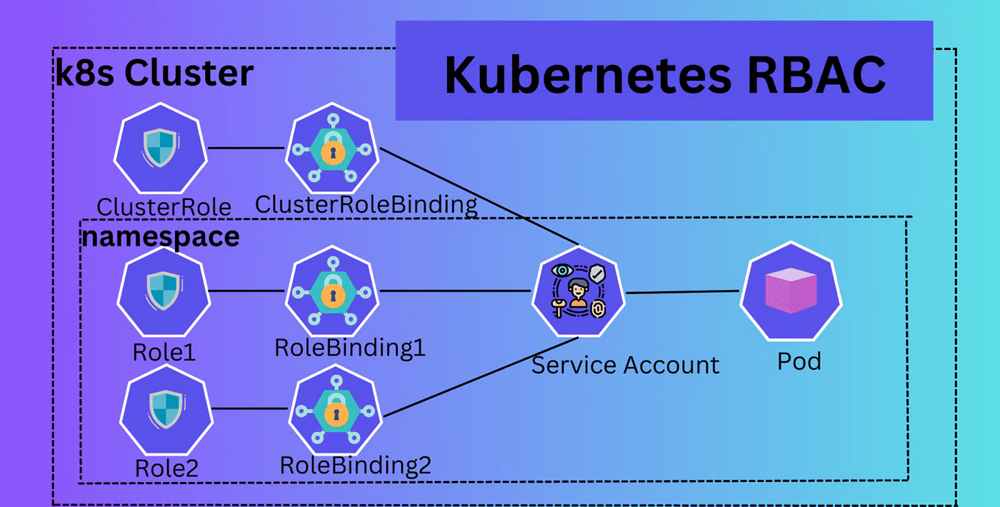
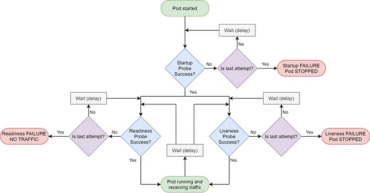
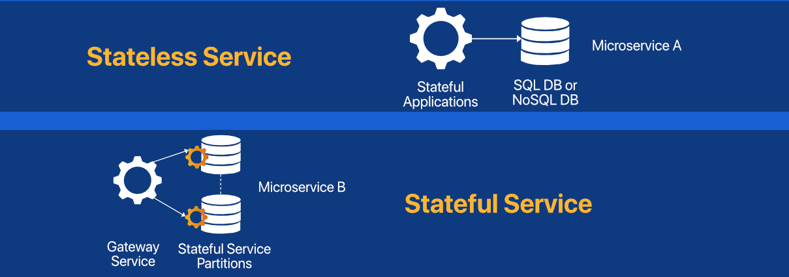
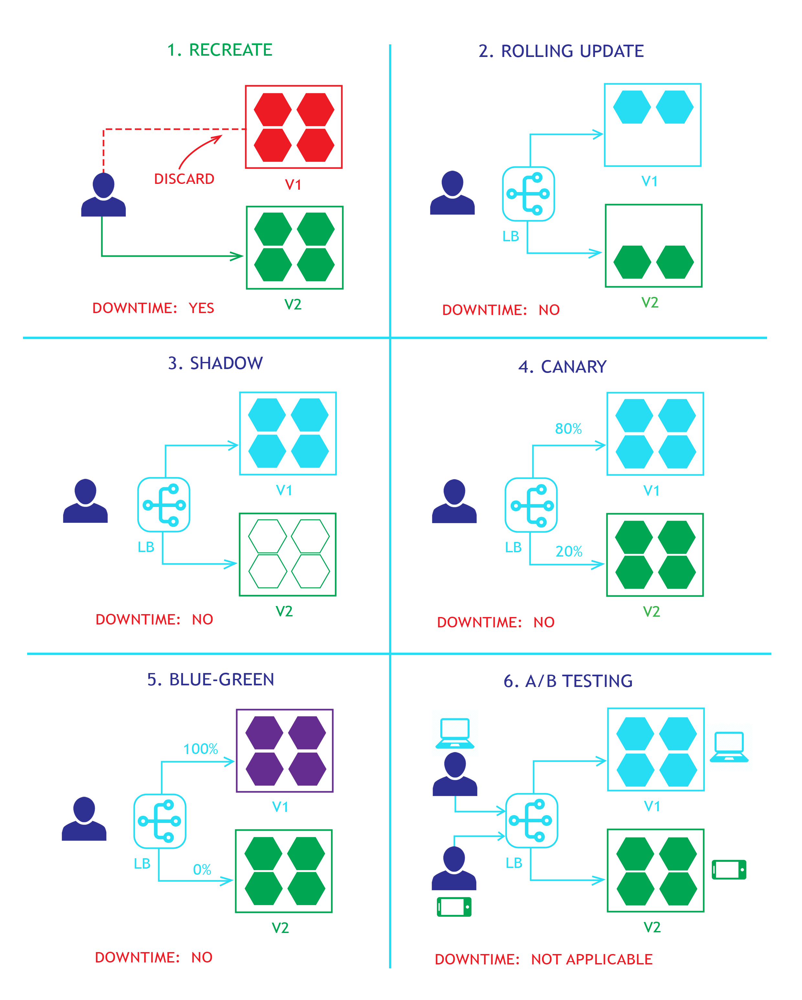

# Kubernetes

* is an open source system for automating deployment, scaling, and management of containerized applications.

* Container Orchestration tool

* known as K8S ( 8 is meaning 8 letters bettwen k and s)

---

## Table of Contents

1. [Cluster Architecture](#k8s-cluster-components)
   - [Control/Master Node](#control-master-node)
   - [Worker Node](#worker-node)
   - [Addons](#addons)
2. [High Availability (HA)](#high-availability-ha)
3. [Tools](#tools)
4. [Cluster Management](#manage-cluster)
5. [Namespaces](#namespaces)
6. [RBAC (Role Based Access Control)](#role-based-access-control-rbac)
7. [Application Configuration](#application-configuration)
   - [ConfigMap](#configmap)
   - [Secret](#secret)
8. [Storage](#storage)
   - [Volumes](#volume)
   - [PersistentVolume](#persistencevolume-pv)
   - [PersistentVolumeClaim](#persistentvolumeclaim-pvc)
   - [StorageClass](#storage-class)
9. [Pods](#pods)
   - [Container Resources](#containers-resources-cpu--memory)
   - [Health Checks](#container-healthcheck)
   - [Restart Policies](#restart-policies)
   - [Sidecar Containers](#sidecar-container)
   - [Init Containers](#init-container)
   - [Scheduling](#scheduling-pods)
10. [DaemonSets](#daemonsets)
11. [Static Pods](#static-pod)
12. [App Scaling](#app-scaling)
13. [Stateless and Stateful Apps](#stateless-ans-statful)
14. [ReplicationController & ReplicaSet](#replicationcontrollller-and-replicaset)
15. [Deployments](#deployment)
    - [Deployment Strategies](#deployment-strategy)
16. [Networking](#k8s-networking)
    - [CNI](#container-network-interface-cni)
    - [DNS](#dns)
    - [Network Policies](#network-policy)
    - [Services](#service)
    - [Ingress](#ingress)
    - [IngressClass](#ingress-class)
17. [Jobs & CronJobs](#jobs--cronjobs)
18. [Taints & Tolerations](#taints--tolerations)
19. [Resource Quotas & LimitRanges](#resource-quotas--limitranges)
20. [Horizontal Pod Autoscaler (HPA)](#horizontal-pod-autoscaler-hpa)
21. [Helm](#helm)
22. [kubectl Cheat Sheet](#kubectl-cheat-sheet)
23. [Troubleshooting](#troubleshooting)

---

## K8S Cluster Components


### 1. Control/Master Node

> **💡 Production Note:** For production, always run **at least 3 control plane nodes** for high availability. Single control plane = single point of failure.

#### kube-apiserver

* the front end for the Kubernetes control plane.

* designed to scale horizontally

* it exposes the Kubernetes API, allowing users, external tools, and other cluster components to communicate with the cluster, and manage its resources

* handles authentication of API requests and performs authorization checks to ensure that users and service accounts have the necessary permissions to perform requested actions.

* validates and configures data for API objects

> **📌 Key Details:**
> - Default port: `6443` (HTTPS)
> - All components communicate through the API server (never directly with each other)
> - Stateless - can run multiple instances behind a load balancer


#### etcd 

* key value database stores cluster information (configuration, state, metadata)

> **⚠️ Critical Production Notes:**
> - **Always backup etcd regularly** - losing etcd = losing the entire cluster state
> - Run **odd number of nodes** (3, 5, 7) for quorum
> - Default port: `2379` (client), `2380` (peer)
> - Recommended: Use SSDs for etcd storage (latency-sensitive)
> - Backup command: `etcdctl snapshot save /backup/etcd-snapshot.db`

#### kube-controller-manager

* monitors the cluster's state through the Kubernetes API server

* runs controller loops that watch the cluster state and make changes to move current state → desired state

* types

    * Replication Controller : Ensures the desired number of Pod replicas are running

    * Namespace Controller: Creates and manages Kubernetes namespaces

    * Endpoints Controller: Maintains an Endpoints object for each Service

    * Service Account Controller: Creates and manages Service Accounts used for Pod authentication and authorization.

    * Node Controller: Tracks the health and availability of Nodes in the cluster.

    * Token Controller: Responsible for issuing authentication tokens for service accounts.

    * Lease Controller: Enforces leasing mechanisms for certain resources to prevent conflicts and maintain coordination.

> **📌 Key Details:**
> - Default port: `10257`
> - Only ONE active controller-manager at a time (leader election)
> - `--node-monitor-grace-period` controls how long before marking node unhealthy (default: 40s)

#### kube-scheduler

* assigns pods to suitable nodes based on various factors

> **📌 Scheduling Factors:**
> - Resource requests/limits (CPU, memory)
> - Node affinity/anti-affinity rules
> - Taints and tolerations
> - Pod topology spread constraints
> - Inter-pod affinity
> - Custom scheduler priorities
> 
> Default port: `10259`

#### cloud-controller-manager

*  link the cluster into cloud provider's API

* types

    * Node Controller: responsible for checking if a particular node is present in the cloud or not and updating the node labels with appropriate labels and annotations

    * Route Controller: responsible for configuring routes in the cloud environment 

    * Service Controller: responsible for creating a load balancer in the cloud environment.

> **💡 Note:** Only present in cloud-managed clusters (EKS, GKE, AKS) or when using cloud-provider integration.

---

### 2. Worker Node

> **💡 Production Recommendations:**
> - Minimum 2 worker nodes for redundancy
> - Size nodes appropriately (don't run too many small nodes - overhead increases)
> - Consider dedicated node pools for different workload types

#### kubelet

* agent that runs on each node in the cluster

* makes sure that containers are running in a Pod.

* doesn't manage containers which were not created by Kubernetes

* acts as the bridge between the Kubernetes control plane and the node, and interacting with the container runtime to execute and manage containers

* monitors the health of pods and their containers using `liveness and readiness probes`.

* Manages resources on the node and can perform evictions if thresholds are met (terminate)

* it sends gRPC requests through the CRI to the container runtime

> **📌 Key Details:**
> - Default port: `10250`
> - Config file: `/var/lib/kubelet/config.yaml`
> - Logs: `journalctl -u kubelet`
> - Key flags: `--max-pods` (default 110), `--eviction-hard`

#### kube-proxy

* network proxy that runs on each node in your cluster

* maintains network rules on nodes (iptables/IPVS)

* no need for kube-proxy if network plugins which forward packets to services are used

> **📌 Proxy Modes:**
> - `iptables` (default) - good for <1000 services
> - `ipvs` - better performance for large clusters (1000+ services)
> - `kernelspace` - Windows nodes
>
> Default port: `10256`

#### container runtime

* responsible for running containers

* it links to a third party project or product that is not part of Kubernetes itself

* installed on each node in the cluster

* k8s interacts with container runtimes through the `CRI` (container runtime interface : standard API. It acts as a "plugin" interface)

* types

    * low-level : `runc`
    
    * high-level

        * containerd (most common, Docker default)

        * CRI-O (RedHat/OpenShift default)

> **Runtime Analogy:**
> - **Low-Level Runtime (runc)**: This is the engine. It just does one job: it takes instructions and runs the container.
> - **High-Level Runtime (containerd, CRI-O)**: This is the car's internal system. It manages the engine (runc), pulls images, and handles lifecycle, networking, and storage.
> - **Container Engine (Docker, Podman)**: This is the complete car experience with user-friendly CLI.

> **💡 Production Note:** Docker was deprecated as a runtime in K8s 1.24+. Use `containerd` or `CRI-O` directly.

---

### 3. Addons

Use Kubernetes resources (DaemonSet, Deployment, etc) to implement cluster features:

| Addon | Purpose | Examples |
|-------|---------|----------|
| **DNS** | Service discovery within cluster | CoreDNS (required) |
| **Dashboard** | Web UI for cluster management | Kubernetes Dashboard |
| **Network Plugin** | Pod networking (CNI) | Calico, Cilium, Flannel, Weave |
| **Metrics** | Resource metrics collection | Metrics Server (required for HPA) |
| **Logging** | Centralized log collection | Fluentd, Fluent Bit |
| **Ingress Controller** | External HTTP(S) routing | NGINX, Traefik, HAProxy |


## High Availability (HA) 

* refers to the design and implementation of a cluster to ensure continuous operation and minimize downtime even in the event of component failures.

> **💡 HA Requirements:**
> - Minimum 3 control plane nodes (odd number for quorum)
> - Load balancer in front of API servers
> - Replicated etcd cluster
> - Multiple worker nodes across availability zones

### Topology Comparison

| Aspect | Stacked etcd | External etcd |
|--------|--------------|---------------|
| **Nodes Required** | 3 control plane | 3 control plane + 3 etcd |
| **Complexity** | Lower | Higher |
| **Failure Impact** | Losing node = losing etcd member | Separated failure domains |
| **Best For** | Small/Medium clusters | Large production clusters |

### 1. Stacked etcd topology


* distributed data storage cluster provided by etcd is stacked on top of the cluster formed by the nodes managed by kubeadm that run control plane components.

* each `control plane node` runs an instance of the `kube-apiserver`, `kube-scheduler`, and `kube-controller-manager`. The `kube-apiserver` is `exposed to worker nodes using a load balancer`.

* Each `control plane node` creates a `local etcd member` and this `etcd member` communicates `only` with the `kube-apiserver`

> ⚠️ _If one node goes down, both an etcd member and a control plane instance are lost, and redundancy is compromised._ Mitigate by adding more control plane nodes.


### 2. External etcd topology


* the distributed data storage cluster provided by etcd is external to the cluster formed by the nodes that run control plane components.

* each `control plane node` in an `external etcd topology` runs an instance of the `kube-apiserver`, `kube-scheduler`, and `kube-controller-manager`. And the `kube-apiserver` is `exposed to worker nodes` using a `load balancer`.

* each `etcd host` communicates with the `kube-apiserver` of each `control plane node`.

* losing a `control plane instance` or an `etcd member` has `less impact` and `does not affect the cluster redundancy` as much as the stacked HA topology.

* requires `twice the number of hosts` as the `stacked HA topology`

> **💡 Load Balancer Options:**
> - Cloud LB (AWS ALB/NLB, GCP LB, Azure LB)
> - HAProxy
> - NGINX
> - kube-vip (for bare metal)

---

## Tools

| Tool | Purpose | Use Case |
|------|---------|----------|
| **kubectl** | Official CLI for K8s | Daily operations, debugging, resource management |
| **minikube** | Local single-node cluster | Local development, learning |
| **kind** | K8s in Docker | CI/CD testing, local multi-node |
| **kubeadm** | Cluster bootstrapping | Production cluster setup |
| **Helm** | Package manager | Deploy complex apps, templating |
| **kustomize** | Configuration management | Environment-specific overlays |
| **kompose** | Docker Compose → K8s | Migration from Docker Compose |
| **k9s** | Terminal UI | Real-time cluster monitoring |
| **Lens** | Desktop GUI | Visual cluster management |
| **kubectx/kubens** | Context/namespace switching | Multi-cluster management |

> **💡 Must-Have Tools for DevOps:**
> - `kubectl` + shell completion
> - `k9s` for interactive debugging
> - `kubectx` + `kubens` for multi-cluster work
> - `stern` for multi-pod log tailing

---

## Manage Cluster

> **⚠️ Maintenance Best Practices:**
> - Always drain before maintenance
> - Perform rolling upgrades (one node at a time)
> - Have PodDisruptionBudgets (PDBs) for critical workloads
> - Schedule maintenance during low-traffic periods
> - Test upgrades in staging first

### 1. Drain Nodes

* Evicts all pods (non-daemonset pods) from a node and then marks the node as "unschedulable"

* used for: OS upgrades, hardware replacement, kernel patching

```bash
# Safe drain with defaults
kubectl drain <node-name> --ignore-daemonsets --delete-emptydir-data

# Force drain (use with caution!)
kubectl drain <node-name> --ignore-daemonsets --delete-emptydir-data --force --grace-period=0
```

| Flag | Purpose |
|------|---------|
| `--ignore-daemonsets` | DaemonSet pods are not evicted |
| `--delete-emptydir-data` | Delete pods using emptyDir volumes |
| `--force` | Force eviction even without controller |
| `--grace-period=0` | Immediate termination |
| `--pod-selector` | Only drain pods matching selector |

### 2. Cordon Nodes

* Marks a node as "unschedulable" - prevents new pods from being scheduled

* Existing pods remain running

```bash
kubectl cordon <node-name>
```

### 3. Uncordon Node

* Allow scheduling to the node again

```bash
kubectl uncordon <node-name>
```


### 4. Upgrade Cluster

[Full Upgrade Instructions](./Instructions/k8s_cluster_upgrade.txt)

> **⚠️ Critical Upgrade Rules:**
> - Always upgrade one minor version at a time (1.28 → 1.29, not 1.28 → 1.30)
> - Control plane first, then workers
> - Backup etcd before upgrading

**Control Plane Upgrade:**
```bash
# 1. Drain the control plane node
kubectl drain <cp-node> --ignore-daemonsets

# 2. Upgrade kubeadm
apt-get update && apt-get install -y kubeadm=1.29.x-*

# 3. Verify upgrade plan
kubeadm upgrade plan

# 4. Apply upgrade (first control plane only)
kubeadm upgrade apply v1.29.x

# 5. Upgrade kubelet and kubectl
apt-get install -y kubelet=1.29.x-* kubectl=1.29.x-*

# 6. Restart kubelet
systemctl daemon-reload && systemctl restart kubelet

# 7. Uncordon
kubectl uncordon <cp-node>
```

**Worker Node Upgrade:**
```bash
# 1. Drain worker
kubectl drain <worker-node> --ignore-daemonsets --delete-emptydir-data

# 2. Upgrade kubeadm, kubelet (on the worker node)
apt-get update && apt-get install -y kubeadm=1.29.x-* kubelet=1.29.x-*

# 3. Upgrade node config
kubeadm upgrade node

# 4. Restart kubelet
systemctl daemon-reload && systemctl restart kubelet

# 5. Uncordon
kubectl uncordon <worker-node>
```


## Namespaces

* is a virtual cluster backed by the same physical cluster.

* it provides mechanism for isolating groups of resources within the same cluster.

* name of resources should be unique within the namespace.

* namespaces cannot be nested inside one another.

* each Kubernetes resource can only be in one namespace.

> **💡 When to Use Namespaces:**
> - Multiple teams/projects sharing a cluster
> - Environment separation (dev, staging, prod) in same cluster
> - Resource quota management per team
> - Access control boundaries

### Namespace-Scoped vs Cluster-Scoped Resources

| Namespace-Scoped | Cluster-Scoped |
|------------------|----------------|
| Pods, Deployments, Services | Nodes, PersistentVolumes |
| ConfigMaps, Secrets | ClusterRoles, ClusterRoleBindings |
| Roles, RoleBindings | Namespaces, StorageClasses |
| NetworkPolicies | IngressClasses |

```bash
# View all namespace-scoped resources
kubectl api-resources --namespaced=true

# View all cluster-scoped resources
kubectl api-resources --namespaced=false
```

### Default Namespaces

| Namespace | Purpose |
|-----------|---------|
| `default` | Default for resources without a namespace |
| `kube-system` | System components (API server, scheduler, etc.) - **don't modify** |
| `kube-public` | Publicly readable, cluster-info ConfigMap |
| `kube-node-lease` | Node heartbeat leases for health detection |

> **⚠️ Best Practices:**
> - Never deploy applications to `default` namespace in production
> - Use meaningful namespace names (e.g., `app-name-env`)
> - Apply ResourceQuotas and LimitRanges per namespace
> - Implement NetworkPolicies for namespace isolation

### Working with Namespaces

```bash
# Create namespace
kubectl create namespace dev
kubectl create ns prod

# List namespaces
kubectl get namespaces

# Get resources in namespace
kubectl get pods -n kube-system
kubectl get all -n dev

# Set default namespace for context
kubectl config set-context --current --namespace=dev

# Verify current namespace
kubectl config view --minify | grep namespace:

# Delete namespace (deletes ALL resources in it!)
kubectl delete namespace dev
```

> **⚠️ Warning:** Deleting a namespace deletes ALL resources within it. This cannot be undone.


## Role Based Access Control (RBAC)

* [doc-link](https://kubernetes.io/docs/reference/access-authn-authz/rbac/)

* uses the `rbac.authorization.k8s.io` API group 

* security mechanism that regulates access to Kubernetes API resources

> **💡 RBAC Best Practices:**
> - Follow principle of least privilege
> - Use Roles (namespaced) over ClusterRoles when possible
> - Avoid wildcards (`*`) in production
> - Audit RBAC permissions regularly
> - Never give `cluster-admin` to applications

### RBAC Verbs

| Verb | Description |
|------|-------------|
| `get` | Read a single resource |
| `list` | Read multiple resources |
| `watch` | Stream resource changes |
| `create` | Create new resources |
| `update` | Modify existing resources |
| `patch` | Partially modify resources |
| `delete` | Delete resources |
| `deletecollection` | Delete multiple resources |
| `*` | All verbs (avoid in production) |

### Role vs ClusterRole

| Aspect | Role | ClusterRole |
|--------|------|-------------|
| **Scope** | Single namespace | Cluster-wide |
| **Namespaced** | Yes | No |
| **Use With** | RoleBinding | RoleBinding or ClusterRoleBinding |
| **Use Case** | App-specific access | Cross-namespace or cluster resources |

### Working with RBAC

```bash
# Check if you can perform an action
kubectl auth can-i create pods
kubectl auth can-i delete deployments -n production
kubectl auth can-i '*' '*'  # Check if cluster-admin

# Check permissions as another user
kubectl auth can-i create pods --as=jane

# List roles/clusterroles
kubectl get roles -A
kubectl get clusterroles

# Describe role
kubectl describe role pod-reader -n default

# Check who can perform an action
kubectl auth who-can create pods -n default
```

### Types of RBAC Objects

#### Roles

* define a set of permissions within a specific namespace.

```yaml
apiVersion: rbac.authorization.k8s.io/v1
kind: Role
metadata:
  namespace: default
  name: pod-reader
rules:
- apiGroups: [""] # "" indicates the core API group
  resources: ["pods", "pods/log"]   # for all resources we can use ["*"]
  verbs: ["get", "watch", "list"]   # ["*"]

```

#### ClusterRoles 

* define the permissions accross the cluster

```yaml
apiVersion: rbac.authorization.k8s.io/v1
kind: ClusterRole
metadata:
  # "namespace" omitted since ClusterRoles are not namespaced
  name: secret-reader
rules:
- apiGroups: [""]
  #
  # at the HTTP level, the name of the resource for accessing Secret
  # objects is "secrets"
  resources: ["secrets"]
  verbs: ["get", "watch", "list"]

```

#### RoleBindings 

* associates a Role with a user, group, or service account within a specific namespace

```yaml
apiVersion: rbac.authorization.k8s.io/v1
# This role binding allows "jane" to read pods in the "default" namespace.
# You need to already have a Role named "pod-reader" in that namespace.
kind: RoleBinding
metadata:
  name: read-pods
  namespace: default
subjects:
# You can specify more than one "subject"
- kind: User
  name: jane # "name" is case sensitive
  apiGroup: rbac.authorization.k8s.io
roleRef:
  # "roleRef" specifies the binding to a Role / ClusterRole, This kind of reference lets you define a set of common roles across your cluster, then reuse them within multiple namespaces.
  kind: Role #this must be Role or ClusterRole
  name: pod-reader # this must match the name of the Role or ClusterRole you wish to bind to
  apiGroup: rbac.authorization.k8s.io

```

#### ClusterRoleBinding

* associates a ClusterRole with a user, group, or service account across the cluster

```yaml
apiVersion: rbac.authorization.k8s.io/v1
# This cluster role binding allows anyone in the "manager" group to read secrets in any namespace.
kind: ClusterRoleBinding
metadata:
  name: read-secrets-global
subjects:
- kind: Group
  name: manager # Name is case sensitive
  apiGroup: rbac.authorization.k8s.io
roleRef:
  kind: ClusterRole         
  name: secret-reader
  apiGroup: rbac.authorization.k8s.io

```

* __`roleRef` is immutable__

    * After creating the binding, we cannot change the Role or ClusterRole that it refers to. 

    * To change the referenced role, you must delete the old binding and create a new one.

    * it prevents users from accidentally or maliciously changing a user's permissions.


### Aggregated ClusterRoles 

* merges permissions from multiple ClusterRoles into a single, larger role using labels

* avoid edit the main ClusterRole

```yaml
apiVersion: rbac.authorization.k8s.io/v1
kind: ClusterRole
metadata:
  name: monitoring
aggregationRule:
  clusterRoleSelectors:
  - matchLabels:
      rbac.example.com/aggregate-to-monitoring: "true"
rules: [] # The control plane automatically fills in the rules

---

apiVersion: rbac.authorization.k8s.io/v1
kind: ClusterRole
metadata:
  name: aggregate-cron-tabs-edit
  labels:
    # Add these permissions to the "admin" and "edit" default roles.
    rbac.authorization.k8s.io/aggregate-to-admin: "true"
    rbac.authorization.k8s.io/aggregate-to-edit: "true"
rules:
- apiGroups: ["stable.example.com"]
  resources: ["crontabs"]
  verbs: ["get", "list", "watch", "create", "update", "patch", "delete"]

---

kind: ClusterRole
apiVersion: rbac.authorization.k8s.io/v1
metadata:
  name: aggregate-cron-tabs-view
  labels:
    # Add these permissions to the "view" default role.
    rbac.authorization.k8s.io/aggregate-to-view: "true"
rules:
- apiGroups: ["stable.example.com"]
  resources: ["crontabs"]
  verbs: ["get", "list", "watch"]
```

### ServiceAccount

* used by the container process to authenticate  with the K8S API 

* Kubernetes automatically assigns the ServiceAccount named default in default namespace.

```yaml
apiVersion: v1
kind: ServiceAccount
metadata:
  name: build-robot
automountServiceAccountToken: false
```




## Application Configuration

* K8s allows passing dynamic configuration values at application runtime

### ConfigMap vs Secret

| Aspect | ConfigMap | Secret |
|--------|-----------|--------|
| **Purpose** | Non-sensitive config | Sensitive data (passwords, keys) |
| **Encoding** | Plain text | Base64 encoded |
| **Size Limit** | 1 MiB | 1 MiB |
| **Encryption** | No | Optional (at rest) |

> **💡 Best Practices:**
> - Use Secrets for passwords, tokens, keys, certificates
> - Consider external secret managers (Vault, AWS Secrets Manager) for production
> - Set `immutable: true` for configs that shouldn't change
> - Mount as files when possible (auto-updates without pod restart)

---

### ConfigMap

* used to assign non-sensitive configuration

* key value format

* data stored in a ConfigMap cannot exceed 1 MiB

#### Working with ConfigMaps

```bash
# Create from literal
kubectl create configmap my-config --from-literal=key1=value1 --from-literal=key2=value2

# Create from file
kubectl create configmap my-config --from-file=config.properties
kubectl create configmap my-config --from-file=my-key=config.properties  # custom key name

# Create from directory (each file becomes a key)
kubectl create configmap my-config --from-file=./config-dir/

# View configmap
kubectl get configmap my-config -o yaml
kubectl describe configmap my-config

# Edit configmap
kubectl edit configmap my-config
```

```yaml
apiVersion: v1
kind: ConfigMap
metadata:
  name: game-demo
data:

  # property-like keys; each key maps to a simple value
  player_initial_lives: "3"
  ui_properties_file_name: "user-interface.properties"

  # file-like keys
  game.properties: |
    enemy.types=aliens,monsters
    player.maximum-lives=5    
  user-interface.properties: |
    color.good=purple
    color.bad=yellow
    allow.textmode=true

immutable: true  # set the configmap immutable
```


* ways to use ConfigMap in the pod containers

    * Inside a container command and args
    * Environment variables for a container
    * Add a file in read-only volume, for the application to read
    * Write code to run inside the Pod that uses the Kubernetes API to read a ConfigMap

```yaml
apiVersion: v1
kind: Pod
metadata:
  name: configmap-demo-pod
spec:
  containers:
    - name: demo
      image: alpine
      command: ["sleep", "3600"]
      env:
        # Define the environment variable
        - name: PLAYER_INITIAL_LIVES # Notice that the case is different here
                                     # from the key name in the ConfigMap.
          valueFrom:
            configMapKeyRef:
              name: game-demo           # name of the  ConfigMap 
              key: player_initial_lives # The key to fetch.
        - name: UI_PROPERTIES_FILE_NAME
          valueFrom:
            configMapKeyRef:
              name: game-demo
              key: ui_properties_file_name

      # or use this 

      #envFrom:
      #  - configMapRef:
      #      name: myconfigmap    # name of the configmap


      volumeMounts:
      - name: config
        mountPath: "/config"  # inside the container
        readOnly: true
        # defaultMode: 0444 # Read-only permissions for owner, group, and others
  volumes:
  # You set volumes at the Pod level, then mount them into containers inside that Pod
  - name: config
    configMap:
      # Provide the name of the ConfigMap you want to mount.
      name: game-demo
      # An array of keys from the ConfigMap to create as files
      items:
      - key: "game.properties"
        path: "game.properties"
      - key: "user-interface.properties"
        path: "user-interface.properties"
        
```

### Secret

* used to store sensitive data (passwords, tokens, keys)

* data is Base64 encoded (NOT encrypted by default!)

* mounted as files or environment variables

> **⚠️ Security Notes:**
> - Base64 is NOT encryption - anyone with API access can decode
> - Enable encryption at rest in production
> - Use RBAC to restrict Secret access
> - Consider external secret management (Vault, AWS Secrets Manager, External Secrets Operator)

#### Secret Types

| Type | Usage |
|------|-------|
| `Opaque` | User-defined data (default) |
| `kubernetes.io/tls` | TLS certificates |
| `kubernetes.io/dockerconfigjson` | Docker registry credentials |
| `kubernetes.io/basic-auth` | Basic authentication |
| `kubernetes.io/ssh-auth` | SSH credentials |
| `kubernetes.io/service-account-token` | ServiceAccount token (auto-created) |

#### Working with Secrets

```bash
# Create generic secret
kubectl create secret generic my-secret --from-literal=username=admin --from-literal=password=secret123

# Create from file
kubectl create secret generic my-secret --from-file=./credentials.txt

# Create TLS secret
kubectl create secret tls my-tls --cert=tls.crt --key=tls.key

# Create docker registry secret
kubectl create secret docker-registry regcred \
  --docker-server=registry.example.com \
  --docker-username=user \
  --docker-password=pass \
  --docker-email=user@example.com

# View secret (base64 encoded)
kubectl get secret my-secret -o yaml

# Decode secret value
kubectl get secret my-secret -o jsonpath='{.data.password}' | base64 -d

# Encode value for YAML
echo -n "my-password" | base64
```


```yaml
apiVersion: v1
kind: Secret
metadata:
  name: dotfile-secret
data:
  .secret-file: dmFsdWUtMg0KDQo=
type: Opaque

---
apiVersion: v1
kind: Pod
metadata:
  name: secret-dotfiles-pod
spec:
  volumes:
    - name: secret-volume
      secret:
        secretName: dotfile-secret
  containers:
    - name: dotfile-test-container
      image: registry.k8s.io/busybox
      command:
        - ls
        - "-l"
        - "/etc/secret-volume"
      volumeMounts:
        - name: secret-volume
          readOnly: true
          mountPath: "/etc/secret-volume"
```
## Storage

> **💡 Storage Workflow:**
> 1. Admin creates `StorageClass` (defines HOW storage is provisioned)
> 2. Admin/Dynamic creates `PersistentVolume` (actual storage)
> 3. User creates `PersistentVolumeClaim` (request for storage)
> 4. User mounts PVC in Pod via `volumes`

### Storage Comparison

| Type | Scope | Persistence | Use Case |
|------|-------|-------------|----------|
| `emptyDir` | Pod | Deleted with pod | Temp files, cache, sidecar sharing |
| `hostPath` | Node | Persists on node | Node-level data (logs, configs) |
| `configMap/secret` | Cluster | ConfigMap/Secret lifetime | Configuration injection |
| `PersistentVolume` | Cluster | Independent of pod | Databases, stateful apps |

### Access Modes

| Mode | Abbreviation | Description |
|------|--------------|-------------|
| `ReadWriteOnce` | RWO | Single node read-write |
| `ReadOnlyMany` | ROX | Multiple nodes read-only |
| `ReadWriteMany` | RWX | Multiple nodes read-write |
| `ReadWriteOncePod` | RWOP | Single pod read-write (K8s 1.22+) |

> **⚠️ Important:** Not all storage backends support all access modes. Check your storage class!

---

### Volume

* provides a way for containers in a pod to access and share data via the filesystem

* important for data persistence and shared storage

#### Volume Types

1. ConfigMap

  * inject configuration data into pods

  * data stored in a ConfigMap can be referenced using this volume type

```yaml
apiVersion: v1
kind: Pod
metadata:
  name: configmap-pod
spec:
  containers:
    - name: test
      image: busybox:1.28
      command: ['sh', '-c', 'echo "The app is running!" && tail -f /dev/null']
      volumeMounts:
        - name: config-vol   # name of the volume
          mountPath: /etc/config  # path in the container
  volumes:
    - name: config-vol   # name of the volume
      configMap:          # type of the volume  always mounted as readOnly
        name: log-config   # name of the configMap
        items:              # may share some items from the configMap 
          - key: log_level
            path: log_level.conf
```

2. emptyDir

  * created when the Pod is assigned to a node

  * all containers in the Pod can read and write the same files in the emptyDir volume

  * can be mounted at the same or different paths in each container

  * if pod removed the volume removed but when container removed has no affect on the volume

  * by default are stored on whatever medium that backs the node such as disk, SSD, or network storage, depending on your environment
  * used for Sharing Data Between Containers, Temporary File Storage, High-Speed In-Memory Storage when assign `medium: "Memory"`

```yaml

spec:
  containers:
  - image: registry.k8s.io/test-webserver
    name: test-container
    volumeMounts:
    - mountPath: /cache
      name: cache-volume
  volumes:
  - name: cache-volume
    emptyDir:
      sizeLimit: 500Mi
      medium: Memory   # memory storage

```

3. hostPath

  * mounts a file or directory from the host node's filesystem into the Pod

  * presents many security risks. insted it use `local persistence volume`

  * uses 

    * running a container that needs access to node-level system components such as reading logs 

    * making a configuration file stored on the host system available read-only to a static pod as it can not access configMap


```yaml
 volumeMounts:
    - mountPath: /foo
      name: example-volume
      readOnly: true        # restict the access that is for more security
  volumes:
  - name: example-volume
    # mount /data/foo, but only if that directory already exists
    hostPath:
      path: /data/foo # directory location on host
      type: Directory # this field is optional default is "" means no checks will be performed before mounting the hostPath volume
```

  * hostPath type

    1. `""` it is the default value which means no checks will be performed befor mounting the hostPath volume

    2. `DirectoryOrCreate` if the path not exist then it will be created with permissions `0755`

    3. `Directory` directory must exist at the given path

    4. `FileOrCreate` If nothing exists at the path, an empty file is created with permissions 0644`, If the parent directory of the mounted file does not exist, the pod fails to start

    5. `File` A file must already exist at the given path.

    6. `Socket` A UNIX socket must already exist at the given path.

    7. `CharDevice` A character device must exist at the path (Linux nodes only).

    8. `BlockDevice`  A block device must exist at the path (Linux nodes only).


4. other types

  * `gitRepo` mounts a git repo as a volume

  * `image` mounts an OCI object (a container image or artifact) that is available on the kubelet's host machine

  * `nfs` mounts an existing NFS (Network File System) share. Data is preserved, and it can be mounted by multiple writers simultaneously.

  * `local` used when creating `PresistenceVolume`, It requires nodeAffinity to be set on the PersistentVolume so the scheduler can place the Pod on the correct node. 

  * `persistentVolumeClaim`  Used to mount a `PersistentVolume` into a Pod, allowing users to claim durable storage without knowing the details of the particular cloud environment.

  * `secret` used to pass sensitive information, such as passwords, to Pods. mounted as `readOnly`

```yaml

volumes:
  - name: git-volume
    gitRepo:
      repository: "git@somewhere:me/my-git-repository.git"
      revision: "22f1d8406d464b0c0874075539c1f2e96c253775"
---

volumes:
  - name: volume
    image:
      reference: quay.io/crio/artifact:v2  # Artifact reference
      pullPolicy: IfNotPresent
---
volumes:
  - name: test-volume
    nfs:
      server: my-nfs-server.example.com
      path: /my-nfs-volume
      readOnly: true
```

### PersistentVolume (PV)

* piece of storage in the cluster provisioned by an administrator or dynamically via StorageClass

* lifecycle independent of any pod that uses the PV

> **💡 PV vs PVC:**
> - **PV** = Actual storage resource (admin creates)
> - **PVC** = Request for storage (user creates)
> - **StorageClass** = Defines HOW to provision storage dynamically

#### Working with PV/PVC

```bash
# List PVs and PVCs
kubectl get pv
kubectl get pvc -A

# Describe
kubectl describe pv my-pv
kubectl describe pvc my-pvc

# Check PV/PVC binding status
kubectl get pv -o wide
kubectl get pvc -o wide

# Delete (careful with reclaim policy!)
kubectl delete pvc my-pvc
kubectl delete pv my-pv
```

#### Reclaim Policies

| Policy | Behavior | Use Case |
|--------|----------|----------|
| `Retain` | PV remains, requires manual cleanup | Production data you want to keep |
| `Delete` | PV and storage deleted automatically | Temporary/test environments |
| `Recycle` | ⚠️ Deprecated | Don't use |

> **⚠️ Warning:** With `Delete` policy, deleting the PVC also deletes the underlying storage and ALL DATA!

#### PV Provisioning

1. **Static** - Admin manually creates PVs

2. **Dynamic** - StorageClass automatically provisions PV when PVC is created

#### PV Binding

  * control loop in the control plane watches for new PVCs, finds a matching PV, and binds them together. if `PV` dynamicaly provisioned, loop always bind that PV to the PVC

#### Storage Object in use Protection

  * prevents data loss by stopping the deletion of PVCs or PVs that are actively in use.

  * protection is managed using `finalizers` (e.g., kubernetes.io/pvc-protection). ensures that PVs with a `Delete` policy are only removed after the backing storage has been successfully deleted.

  
#### Reclaiming

  * define the affect of PV after deleting the PVC

  1. `Retain` 

  * PV and its data remains after deleting PVC

  * Volume is `released` and require manual cleanup


  2. `Delete`

  * default for dynamic provisioning

  * deletes both the PV object and the associated storage asset in the external infrastructure.

  3. `Recycle (deprecated)`

  * performs a basic scrub (rm -rf /thevolume/*) on the volume. and makes it available again for a new claim.

#### PV Types

[Types of Persistent Volumes](https://kubernetes.io/docs/concepts/storage/persistent-volumes/#types-of-persistent-volumes)

#### Access Modes

1. `ReadWriteOnce` volume can be mounted as read-write by a single node, allow multiple pods in the same node to access the volume at the same time

2. `ReadOnlyMany` volume can be mounted as read-only by many nodes.

3. `ReadWriteMany` volume can be mounted as read-write by many nodes.

4. `ReadWriteOncePod`  volume can be mounted as read-write by a single Pod


```yaml
apiVersion: v1
kind: PersistentVolume
metadata:
  name: my-pv-volume
spec:
  capacity:
    storage: 1Gi
  volumeMode: Filesystem  # by default is Filesystem, mounted into Pods into a directory 
                         # another mode is  `Block` volume is presented into a Pod as a block device without any filesystem on it
  accessModes:
    - ReadWriteOnce
  persistentVolumeReclaimPolicy: Retain
  storageClassName: manual
  # The actual storage details vary based on the storage type (e.g., nfs, awsEbs, azureDisk)
  nfs:
    path: /mnt/nfs/data
    server: 192.168.1.100
```


#### PV Phase

1. `Available` : The volume is free and not currently bound to any claim.

2. `Bound` : The volume is actively bound to a PersistentVolumeClaim (PVC).

3. `Released` : The associated PVC has been deleted, but the cluster has not yet reclaimed the storage resource.

4. `Failed` : The volume's automated reclamation process has failed.


### PersistentVolumeClaim (PVC) 

  * it is a request for storage by a user.

  * Pods consume node resources and PVCs consume PV resources

  * `Pods` can request specific levels of resources (CPU and Memory). `Claims` can request specific `size` and `access modes`

  * Pods access storage by mounting the PVC as a volume. The Pod and the PVC must exist in the same namespace.

  * only expand a `PVC` if its `storage class`'s `allowVolumeExpansion` field is set to `true`.

```yaml
apiVersion: v1
kind: PersistentVolumeClaim
metadata:
  name: myclaim
spec:
  accessModes:
    - ReadWriteOnce
  volumeMode: Filesystem
  resources:
    requests:
      storage: 8Gi
  storageClassName: slow    # Bound with pv if has the same storage class name, PVCs don't necessarily have to request a class, set it ""  bound only to PVs of that default storageClass
  selector:       # volumes whose labels match the selector can be bound to the claim
    matchLabels:
      release: "stable"
    matchExpressions:
      - {key: environment, operator: In, values: [dev]}

---

# PVC from volume snapshot
spec:
  storageClassName: csi-hostpath-sc
  dataSource:
    name: new-snapshot-test
    kind: VolumeSnapshot
    apiGroup: snapshot.storage.k8s.io
  accessModes:
    - ReadWriteOnce
  resources:
    requests:
      storage: 10Gi

---
# Clone a PVC

spec:
  storageClassName: my-csi-plugin
  dataSource:
    name: existing-src-pvc-name
    kind: PersistentVolumeClaim
```

### Storage Class

* defines the type of storage and how to provision it dynamically

* primary mechanism for `dynamic provisioning` - automatically creates PV when PVC is created

> **💡 Key Concept:** StorageClass = "Recipe" for creating storage

#### Common Cloud Provisioners

| Cloud | Provisioner | Volume Type |
|-------|-------------|-------------|
| AWS EBS | `ebs.csi.aws.com` | Block storage |
| AWS EFS | `efs.csi.aws.com` | File storage (RWX) |
| GCP PD | `pd.csi.storage.gke.io` | Persistent Disk |
| Azure Disk | `disk.csi.azure.com` | Managed Disk |
| Azure File | `file.csi.azure.com` | File share (RWX) |
| Local | `kubernetes.io/no-provisioner` | Local disk |

#### Binding Modes

| Mode | Behavior |
|------|----------|
| `Immediate` | PV created immediately when PVC is created |
| `WaitForFirstConsumer` | PV created only when Pod is scheduled (recommended for topology-aware) |

#### Working with StorageClass

```bash
# List storage classes
kubectl get storageclass
kubectl get sc

# Set default storage class
kubectl patch storageclass <sc-name> -p '{"metadata": {"annotations":{"storageclass.kubernetes.io/is-default-class":"true"}}}'
```

```yaml
apiVersion: storage.k8s.io/v1
kind: StorageClass
metadata:
  name: low-latency
  annotations:
    storageclass.kubernetes.io/is-default-class: "false"
provisioner: csi-driver.example-vendor.example
reclaimPolicy: Retain # default value is Delete
allowVolumeExpansion: true
mountOptions:
  - discard # this might enable UNMAP / TRIM at the block storage layer
volumeBindingMode: WaitForFirstConsumer
parameters:
  guaranteedReadWriteLatency: "true" # provider-specific

allowedTopologies:      # Restrict provisioning to specific zones
- matchLabelExpressions:
  - key: topology.kubernetes.io/zone
    values:
    - us-central-1a
    - us-central-1b
```

#### Provisioner

* `Internal Provisioners`: Legacy in-tree provisioners (e.g., kubernetes.io/vsphere-volume). Many of these, including those for AWS EBS and Azure Disk, are deprecated.

* `External Provisioners`: The recommended approach. These are independent programs that follow the `Container Storage Interface (CSI)` specification (e.g., ebs.csi.aws.com, efs.csi.aws.com).

* `Local Storage`: A special case that uses `kubernetes.io/no-provisioner`. It doesn't dynamically provision new storage but uses `WaitForFirstConsumer` to delay binding until a Pod is scheduled, allowing the Pod to be matched with a pre-existing local PV on a specific node.


## Pods

* set of containers with shared namespaces and shared filesystem volumes.

### Working with Pods

```bash
# List pods
kubectl get pods
kubectl get pods -o wide                    # More details (node, IP)
kubectl get pods -A                         # All namespaces
kubectl get pods -w                         # Watch for changes

# Create pod
kubectl run nginx --image=nginx --port=80
kubectl run nginx --image=nginx --dry-run=client -o yaml > pod.yaml

# Describe pod
kubectl describe pod <pod-name>

# Get pod logs
kubectl logs <pod-name>
kubectl logs <pod-name> -c <container>      # Specific container
kubectl logs <pod-name> --previous          # Previous crashed instance
kubectl logs -f <pod-name>                  # Follow/stream logs

# Execute commands in pod
kubectl exec -it <pod-name> -- /bin/sh
kubectl exec <pod-name> -- ls /app

# Delete pod
kubectl delete pod <pod-name>
kubectl delete pod <pod-name> --force --grace-period=0

# Port forward
kubectl port-forward pod/<pod-name> 8080:80
```

### Containers Resources (cpu & memory)

* Resource Request

  * request amount of that system resource specifically for that container to use

  * `kube-scheduler` uses this information to decide which node to place the Pod

* Resource Limt

  * `kubelet` enforces those limits so that the running container is not allowed to use more of that resource than the limit you set

```yaml
apiVersion: v1
kind: Pod
metadata:
  name: frontend
spec:
# we can assign resources for the pod and its container
  resources:
    limits:
      cpu: "1"
      memory: "200Mi"
    requests:
      cpu: "1"
      memory: "100Mi"

  containers:
  - name: log-aggregator
    image: images.my-company.example/log-aggregator:v6
    resources:
      requests:
        memory: "64Mi"
        cpu: "250m"   # m is millicpu or millicores
      limits:
        memory: "128Mi"
        cpu: "500m"
```

### Container HealthCheck

> **💡 Probe Decision Guide:**
> - **Startup Probe** → Slow-starting apps (DB connections, large caches)
> - **Liveness Probe** → Detect deadlocks, hangs, zombie processes
> - **Readiness Probe** → Temporary unavailability (busy, warming up)

#### Probe Types Comparison

| Probe | Purpose | Action on Failure |
|-------|---------|-------------------|
| `startupProbe` | Is the app started? | Wait, then kill if fails |
| `livenessProbe` | Is the app alive? | Restart container |
| `readinessProbe` | Is the app ready for traffic? | Remove from Service endpoints |

#### Probe Methods

| Method | Use Case | Example |
|--------|----------|---------|
| `httpGet` | REST APIs, web apps | `path: /healthz, port: 8080` |
| `tcpSocket` | TCP services (databases) | `port: 3306` |
| `exec` | Custom scripts | `command: ["/bin/check.sh"]` |
| `grpc` | gRPC services | `port: 50051` |

#### Probe Timing Parameters

| Parameter | Default | Description |
|-----------|---------|-------------|
| `initialDelaySeconds` | 0 | Wait before first probe |
| `periodSeconds` | 10 | How often to probe |
| `timeoutSeconds` | 1 | Probe timeout |
| `successThreshold` | 1 | Consecutive successes needed |
| `failureThreshold` | 3 | Consecutive failures before action |

> **⚠️ Common Mistakes:**
> - Setting `initialDelaySeconds` too low (app not ready)
> - Missing `startupProbe` for slow apps (liveness kills before ready)
> - Liveness probe checking external dependencies (cascading failures!)



#### Probe Examples

* 
```yaml
#....

spec:
  containers:
  - name: liveness
    image: registry.k8s.io/busybox:1.27.2
    args:
    - /bin/sh
    - -c
    - touch /tmp/healthy; sleep 30; rm -f /tmp/healthy; sleep 600
    livenessProbe:
      exec:
        command:
        - cat
        - /tmp/healthy
      initialDelaySeconds: 5   # tells kubelet that it should wait 5 seconds before performing the first probe
      periodSeconds: 5         # kubelet should perform a liveness probe every 5 seconds

---

#....

spec:
  containers:
  - name: liveness
    image: registry.k8s.io/e2e-test-images/agnhost:2.40
    args:
    - liveness
    livenessProbe:
      httpGet:
        path: /healthz
        port: 8080
        httpHeaders:
        - name: Custom-Header
          value: Awesome
      initialDelaySeconds: 3
      periodSeconds: 3

---
#....
ports:
- name: liveness-port
  containerPort: 8080

startupProbe:
  httpGet:
    path: /healthz
    port: liveness-port
  failureThreshold: 30    # the application will have a maximum of 5 minutes (30 * 10 = 300s) to finish its startup, If the startup probe never succeeds, the container is killed after 300s, then restart the pod.
  periodSeconds: 10

---

readinessProbe:
  exec:
    command:
    - cat
    - /tmp/healthy
  initialDelaySeconds: 5
  periodSeconds: 5
```


* configure the probes doc

> [doc](https://kubernetes.io/docs/tasks/configure-pod-container/configure-liveness-readiness-startup-probes/#configure-probes)


### Restart Policies

* k8s has the abaility to restart the container when it fails


1. Always

  * default policy

  * even if run successfully

2. OnFailuer

  * only when container process exit with error code

  * when liveness probe detect that the container is unhealthy

3. Never

  * conatiner never restart even liveness probe detect that the container unhealthy 


```yaml

#...
spec:
  restartPolicy: OnFailure   # restart policy for the pod

  containers:

  - name: try-once-container    # This container will run only once because the restartPolicy is Never.
    image: docker.io/library/busybox:1.28
    command: ['sh', '-c', 'echo "Only running once" && sleep 10 && exit 1']
    restartPolicy: Never     # restart policy for the container

  - name: on-failure-container  # This container will be restarted on failure.
    image: docker.io/library/busybox:1.28
    command: ['sh', '-c', 'echo "Keep restarting" && sleep 1800 && exit 1']
```


### SideCar Container

* are the secondary containers that run along with the main application container within the same Pod

* remain running after Pod startup

* have their own independent lifecycles

* support probes to control their lifecycle.

* Shares the same network and storage as the main app.

*  used to enhance or to extend the functionality of the primary app container by providing additional services, or functionality such as logging, monitoring, security, or data synchronization, without directly altering the primary application code.


```yaml
spec:
      containers:
        - name: myapp
          image: alpine:latest
          command: ['sh', '-c', 'while true; do echo "logging" >> /opt/logs.txt; sleep 1; done']
          volumeMounts:
            - name: data
              mountPath: /opt
      initContainers:
        - name: logshipper
          image: alpine:latest
          restartPolicy: Always
          command: ['sh', '-c', 'tail -F /opt/logs.txt']
          volumeMounts:
            - name: data
              mountPath: /opt
      volumes:
        - name: data
          emptyDir: {}
```


### init Container

* run before the app containers are started.

* always run to completion

* Pod cannot be Ready until all init containers have succeeded

* Shares the same network and storage as the main app.

* Do not support lifecycle, livenessProbe, readinessProbe, or startupProbe.


```yaml
spec:
  containers:
  - name: myapp-container
    image: busybox:1.28
    command: ['sh', '-c', 'echo The app is running! && sleep 3600']
  initContainers:
  - name: init-myservice
    image: busybox:1.28
    command: ['sh', '-c', "until nslookup myservice.$(cat /var/run/secrets/kubernetes.io/serviceaccount/namespace).svc.cluster.local; do echo waiting for myservice; sleep 2; done"]
  - name: init-mydb
    image: busybox:1.28
    command: ['sh', '-c', "until nslookup mydb.$(cat /var/run/secrets/kubernetes.io/serviceaccount/namespace).svc.cluster.local; do echo waiting for mydb; sleep 2; done"]
```

### Scheduling Pods


1. using `nodeSelector`and `nodeName`

```yaml
apiVersion: v1
kind: Pod
metadata:
  name: nginx
  labels:
    env: test
spec:
  containers:
  - name: nginx
    image: nginx
    imagePullPolicy: IfNotPresent
  nodeSelector:       #best practice
    disktype: ssd

  #nodeName: foo-node

```

>  * add label to node   

  `kubectl label nodes <your-node-name> disktype=ssd`

  `kubectl get nodes --show-labels`

2. using Affinity and anti-affinity

* Node affinity functions like the nodeSelector field but is more expressive and allows you to specify `soft rules`

  * two types of node affinity:

    * `requiredDuringSchedulingIgnoredDuringExecution` : Pod won't be scheduled unless the rule is met

    * `preferredDuringSchedulingIgnoredDuringExecution` : scheduler tries to meet the rule but will schedule the Pod elsewhere if no matching Node is found. Preferred rules can be given a `weight (1-100)`


```yaml
apiVersion: v1
kind: Pod
metadata:
  name: with-node-affinity
spec:
  affinity:
    nodeAffinity:
      requiredDuringSchedulingIgnoredDuringExecution:           # required during scheduling pod must pass the conditions
                                                                #  ignore during execution pod still run if label change 
        nodeSelectorTerms:
        - matchExpressions:
          - key: topology.kubernetes.io/zone
            operator: In
            values:
            - antarctica-east1
            - antarctica-west1
      preferredDuringSchedulingIgnoredDuringExecution:        # preferred during scheduling the pod wil be scheduled if rules not satisfied
                                                                #  ignore during execution pod still run if label change  
      - weight: 1
        preference:
          matchExpressions:
          - key: another-node-label-key
            operator: In
            values:
            - another-node-label-value
  containers:
  - name: with-node-affinity
    image: registry.k8s.io/pause:3.8
```

* Node anti-Affinity

  * pods run on a Node that DOES NOT HAVE this label

  * only change the operatore with add `NotIN` or `DoesNotExist` also `Gt` and `Lt` 
```yaml
affinity:
    nodeAffinity:
      requiredDuringSchedulingIgnoredDuringExecution:
        nodeSelectorTerms:
        - matchExpressions:
          - key: topology.kubernetes.io/zone
            operator: NotIn
            values:
            - antarctica-east1
```

> Operatores

| Operator | Behavior |
|---|---|
| In | The label value is present in the supplied set of strings |
|NotIn|The label value is not contained in the supplied set of strings|
|Exists|A label with this key exists on the object|
|DoesNotExist|No label with this key exists on the object|
|Gt|The field value will be parsed as an integer, and that integer is less than the integer that results from parsing the value of a label named by this selector|
|Lt|The field value will be parsed as an integer, and that integer is greater than the integer that results from parsing the value of a label named by this selector|


## DaemonSets


* Run a Copy of the Pod on each cluster node

* best pratctice to use in `monitoring, log collection, proxy configuration`

### Working with DaemonSets

```bash
# List daemonsets
kubectl get daemonsets
kubectl get ds -A                           # All namespaces

# Create daemonset
kubectl apply -f daemonset.yaml

# Describe daemonset
kubectl describe ds <daemonset-name>

# Check rollout status
kubectl rollout status ds/<daemonset-name>

# Update daemonset image
kubectl set image ds/<ds-name> <container>=<new-image>

# Delete daemonset
kubectl delete ds <daemonset-name>
```

```yaml
apiVersion: apps/v1
kind: DaemonSet
metadata:
  name: fluentd-elasticsearch
  namespace: kube-system
  labels:
    k8s-app: fluentd-logging
spec:
  selector:
    matchLabels:
      name: fluentd-elasticsearch
  template:
    metadata:
      labels:
        name: fluentd-elasticsearch
    spec:
      tolerations:
      # these tolerations are to have the daemonset runnable on control plane nodes
      # remove them if your control plane nodes should not run pods
      - key: node-role.kubernetes.io/control-plane
        operator: Exists
        effect: NoSchedule
      - key: node-role.kubernetes.io/master
        operator: Exists
        effect: NoSchedule
      containers:
      - name: fluentd-elasticsearch
        image: quay.io/fluentd_elasticsearch/fluentd:v5.0.1
        resources:
          limits:
            memory: 200Mi
          requests:
            cpu: 100m
            memory: 200Mi
        volumeMounts:
        - name: varlog
          mountPath: /var/log
      # it may be desirable to set a high priority class to ensure that a DaemonSet Pod
      # preempts running Pods
      # priorityClassName: important
      terminationGracePeriodSeconds: 30
      volumes:
      - name: varlog
        hostPath:
          path: /var/log
```

### Static pod

* managed by `kubelet`, API server not required

* `kubelet` automatically tries to create a `mirror Pod` on the Kubernetes API server for each static Pod

* `mirror pod` it is replica of staic pod allow API monitore the static pod

* to create it 

    go to the node where you want to runt the pod

    `/etc/kubernetes/manifests`

    create the pod yaml file

    then reload the `kubelet`  : `systemctl restart kubelet`

    `crictl ps` used to view the running containers

    `crictl stop <container-id>`  stop the running container


```bash
# Run this command on the node where kubelet is running
mkdir -p /etc/kubernetes/manifests/
cat <<EOF >/etc/kubernetes/manifests/static-web.yaml
apiVersion: v1
kind: Pod
metadata:
  name: static-web
  labels:
    role: myrole
spec:
  containers:
    - name: web
      image: nginx
      ports:
        - name: web
          containerPort: 80
          protocol: TCP
EOF
```

## App Scaling

| Type | Method | K8s Resource |
|------|--------|--------------|
| **Vertical (Scale Up)** | Add more CPU/memory | VPA (Vertical Pod Autoscaler) |
| **Horizontal (Scale Out)** | Add more pods | HPA, manual replicas |

> **💡 Rule of Thumb:**
> - Stateless apps → Horizontal scaling (preferred)
> - Stateful apps → Usually vertical, or horizontal with careful design
> - Use HPA for automatic horizontal scaling

---

## Stateless vs Stateful Apps



| Aspect | Stateless | Stateful |
|--------|-----------|----------|
| **Data Storage** | No local state | Stores client data |
| **Scaling** | Horizontal (easy) | Vertical (complex) |
| **Pod Identity** | Interchangeable | Unique, stable identity |
| **K8s Controller** | Deployment | StatefulSet |
| **Examples** | Web servers, APIs | Databases, message queues |

> **💡 StatefulSet Features:**
> - Stable, unique pod names (web-0, web-1, web-2)
> - Ordered deployment and scaling
> - Persistent storage per pod (volumeClaimTemplates)
> - Requires Headless Service (clusterIP: None)

### Working with StatefulSets

```bash
# List statefulsets
kubectl get statefulsets
kubectl get sts -A                          # All namespaces

# Describe statefulset
kubectl describe sts <statefulset-name>

# Scale statefulset
kubectl scale sts <sts-name> --replicas=5

# Check rollout status
kubectl rollout status sts/<sts-name>

# Rollback
kubectl rollout undo sts/<sts-name>

# Delete (pods deleted in reverse order)
kubectl delete sts <sts-name>
kubectl delete sts <sts-name> --cascade=orphan  # Keep pods
```

```yaml
apiVersion: apps/v1
kind: StatefulSet
metadata:
  name: web
spec:
  serviceName: "nginx" # Name of the Headless Service
  replicas: 3
  selector:
    matchLabels:
      app: nginx
  template:
    metadata:
      labels:
        app: nginx
    spec:
      containers:
      - name: nginx
        image: nginx:latest
        ports:
        - containerPort: 80
          name: web
        volumeMounts:
        - name: www
          mountPath: /usr/share/nginx/html
  volumeClaimTemplates:   # Each pod gets its own PVC based on this template
  - metadata:
      name: www
    spec:
      accessModes: [ "ReadWriteOnce" ]
      resources:
        requests:
          storage: 1Gi
```


## ReplicationControlller and ReplicaSet


* ReplicationController : Ensures a specified number of pod replicas are running.

* ReplicaSet : next-generation ReplicationController

* "bare pod" or "standalone pod" refers to a Pod that is created directly without being managed by a higher-level controller like a Deployment, ReplicaSet, Job, or DaemonSet.

```yaml

apiVersion: v1
kind: ReplicationController
metadata:
  name: my-replication-controller
spec:
  replicas: 3
  selector:
    app: my-app
  template:
    metadata:
      labels:
        app: my-app
    spec:
      containers:
        - name: my-container
          image: my-image
---

apiVersion: apps/v1
kind: ReplicaSet
metadata:
  name: my-replicaset
spec:
  replicas: 3
  selector:
    matchExpressions:               # use enchanced selector than rc
      - {key: app, operator: In, values: [my-app]}  # NotIn, values....
  template:
    metadata:
      labels:
        app: my-app
    spec:
      containers:
        - name: my-container
          image: my-image
```

## Deployment


* Deployment provides declarative updates for Pods and ReplicaSets.

* define the desired state in the Deployment specification, and the Deployment Controller automatically changes the actual state to match the desired state at a controlled rate

* uses

    * Rollout a new ReplicaSet to create Pods.

    * Declare a new state (e.g., updating the Pod image) to trigger a gradual scale-up of a new ReplicaSet and scale-down of the old ReplicaSet.

    * Rollback to a previous stable revision.

    * Scale up or down to manage load.

    * Pause and resume rollouts to batch multiple updates.


```yaml

apiVersion: apps/v1
kind: Deployment
metadata:
  name: nginx-deployment
  labels:
    app: nginx    # Deployment's label selector is immutable after it gets created.
spec:
  replicas: 3
  selector:
    matchLabels:
      app: nginx
  template:
    metadata:
      labels:
        app: nginx
    spec:
      containers:
      - name: nginx
        image: nginx:1.14.2
        ports:
        - containerPort: 80
```

* work with deployment   

    * `kubectl set image deployment.v1.apps/nginx-deployment <container-name=new-image>` 

    * `kubectl set image deployment/nginx-deployment <container-name=image-name>`

    * `kubectl edit deployment/nginx-deployment`

    * `kubectl rollout status deployment/nginx-deployment`  : to see the satatus

    * `kubectl rollout history deployment/nginx-deployment`  : check the history

    * `kubectl rollout history deployment/nginx-deployment --revision=2` : see the previous revision number 2

    * `kubectl rollout undo deployment/nginx-deployment`  : rollback to previous revision

    * `kubectl rollout undo deployment/nginx-deployment --to-revision=2`  : rollback to previous revision

    * `kubectl scale deployment/nginx-deployment --replicas=10` scale the deployment

    * `kubectl autoscale deployment/nginx-deployment --min=10 --max=15 --cpu-percent=80`  scale the deployment if `HPA` is enabled

    * `kubectl rollout pause deployment/nginx-deployment`  pause the update

    * `kubectl rollout resume deployment/nginx-deployment`  resume the update

    * `kubectl set resources deployment/nginx-deployment -c=nginx --limits=cpu=200m,memory=512Mi`  update the resources


* updating the deployment process

    * create new replicaset
    * scale up the new replicaset
    * scale down the old replicaset

* failed dwployment 

    * insufficient quota
    * Readiness probe failures
    * Image pull errors
    * Insufficient permissions
    * Limit ranges
    * Application runtime misconfiguration

### Deployment Strategy



1. Recreate Deployment

    * down all pods and recreate a new version of them again

    * good at testing and development environment

```yaml
apiVersion: apps/v1
kind: Deployment
metadata:
  name: my-app-recreate
spec:
  replicas: 3
  strategy:
    type: Recreate # strategy type
  template:
    metadata:
      labels:
        app: my-app
    spec:
      containers:
      - name: my-container
        image: my-app:v2 # Change to :v3 for the update
```

2. Rolling Update

    * default strategy

    * update pod one by one

    * low downtime, easy to roll back to the previous version.

```yaml
apiVersion: apps/v1
kind: Deployment
metadata:
  name: my-app-rolling
spec:
  replicas: 4
  strategy:
    type: RollingUpdate # This is the default, can be omitted
    rollingUpdate:
      maxUnavailable: 25% # Max 1 pod unavailable at any time (1/4 of 4 replicas) , can be number or percentage
      maxSurge: 1 # Max 1 extra pod allowed during the update (total pods: 4+1=5), Pods that can be created over the desired number of replicas
  template:
    # ... Pod template definition with image: my-app:v2 ...
```

3. Blue/Green 

    * two environments side-by-side 

    * blue it is current version

    * green it is the new version

    * cons : Double the resource consumption

    * used when new version may have a risk and rapid rollback is required 

```yaml
# Deployment 'blue-app-v1'
spec:
  selector:
    matchLabels:
      app: my-app
      version: v1 # Blue version label
# ... container image: my-app:v1

---

# Deployment 'green-app-v2'
spec:
  selector:
    matchLabels:
      app: my-app
      version: v2 # Green version label
# ... container image: my-app:v2

---
# to change the traffic from blue to green change the version
apiVersion: v1
kind: Service
metadata:
  name: my-app-service
spec:
  selector:
    app: my-app
    version: v1 # <--- Currently routes to Blue (v1)
  ports:
  - port: 80
# ...
```

4. Canary

    * partial update process

    * allow test the new version on real users without commitment the full rollout

    * Highly risk-mitigating as issues only affect a small user group

5. A/B Testing

    * Multiple versions are concurrently tested on different users to compare performance or user experience.


## K8s Networking

> **💡 Networking Fundamentals:**
> - Every Pod gets its own IP address
> - Pods can communicate with any other Pod without NAT
> - Agents on a node can communicate with all Pods on that node
> - Services provide stable endpoints for Pods

### Container Network Interface (CNI) 

* provides network connectivity to Kubernetes Pods

* CNI plugins assign unique IP addresses to Pods

#### CNI Comparison

| CNI | Features | Best For |
|-----|----------|----------|
| **Calico** | Network policies, BGP, high performance | Production, security-focused |
| **Cilium** | eBPF-based, observability, service mesh | Modern clusters, performance |
| **Flannel** | Simple, overlay network | Learning, simple setups |
| **Weave Net** | Encrypted, resilient | Hybrid/multi-cloud |

> **💡 Production Choice:** Calico or Cilium for most production workloads

---

### DNS

* K8s automatically creates DNS records for Services and Pods
* CoreDNS is the default DNS server

#### DNS Quick Reference

| Type | DNS Name Pattern |
|------|------------------|
| **Service** | `<service>.<namespace>.svc.cluster.local` |
| **Pod** | `<pod-ip-dashed>.<namespace>.pod.cluster.local` |
| **StatefulSet Pod** | `<pod-name>.<service>.<namespace>.svc.cluster.local` |

```bash
# Test DNS resolution from a pod
kubectl run test --image=busybox:1.28 --rm -it -- nslookup kubernetes
kubectl run test --image=busybox:1.28 --rm -it -- nslookup <service-name>.<namespace>
```

### DNS Records

1. Services

* Normal Services (with a Cluster IP)

    * `A` record (or `AAAA` for IPv6) that points to the Service's stable `Cluster IP`.

    * The Name Format: `my-svc.my-namespace.svc.cluster-domain.example` such as `web-app.production.svc.cluster.local`


* Headless Services (without a Cluster IP)

    * `A` record (or `AAAA`) that resolves to the IP addresses of `ALL the Pods` that the Service selects

    * name format : `my-svc.my-namespace.svc.cluster-domain.example`  resolve to the IP of every Pod running the application

* SRV Records (Service Records)

    * provide information about the port and protocol of a named service port.

    * format : `_port-name._port-protocol.my-svc.my-namespace.svc.cluster-domain.example`

2. Pods

* Default Pod Naming (Older Format)

    * `<pod-IPv4-address-with-dashes>.<namespace>.pod.<cluster-domain>`

* Custom Hostname and Subdomain (For specific Naming)

    * give it a special subdomain to create a specific, resolvable Fully Qualified Domain Name (FQDN). commonly used for stateful applications

    * `spec.hostname` 

    * `spec.subdomain` work with Headless Service

    * `<hostname>.<subdomain>.<namespace>.svc.cluster-domain.example`

    * `setHostnameAsFQDN: true` : maked the full FQDN (the long name) be returned as the hostname inside the Pod, instead of just the short hostname.


#### Pod DNS policy  (`dnsPolicy`)

* `ClusterFirst` (Default)	Tries to resolve names inside the cluster first (like web-app.production), then forwards external queries (like www.google.com) to the node's upstream DNS.	Used by default if no policy is set.

* `Default`	The Pod inherits the DNS settings directly from the node it's running on.	When you need the Pod to use the host's DNS setup.

* `ClusterFirstWithHostNet`	Same as `ClusterFirst`, but used specifically for Pods with `hostNetwork: true`.

* `None` Completely `ignores` the `Kubernetes-generated DNS settings`. Requires you to `manually specify all settings` using `dnsConfig`. When you need complete, custom control over the Pod's DNS.

#### DNS Config (`dnsConfig`)

* allows fine-grained customization of DNS settings, especially when using `dnsPolicy: "None"`.

    * `nameservers`: A list of specific IP addresses for the DNS servers to use (max 3).

    * `searches`: A list of search domains to try when resolving a short name.

        * Example: If you query for `web-app` and have `production.svc.cluster.local` in your searches, the DNS will try to resolve `web-app.production.svc.cluster.local`.

    * `options`: Special options for the resolver, like ndots (how many dots a name must have before it's considered fully qualified).

        * Example: Setting `ndots: 2` means a `name with 2` or `more dots` (like `foo.bar`) is tried as a `FQDN` before using search paths.


### Network Policy

* k8s object

* control traffic flow at the IP address or port level (OSI layer 3 or 4)

* cluster must use a network plugin that supports NetworkPolicy enforcement. such as `calico`

* entities that a Pod can communicate with three identifiers

    * other pods that are allowed (exception: a pod cannot block access to itself)

    * namespaces that are allowed

    * ip blocks (exception: traffic to and from the node where a Pod is running is always allowed)

* ingress : incoming traffic to the pod

* egress : outcoming traffic from the pod, By default, a pod is `non-isolated` for egress


```yaml
apiVersion: networking.k8s.io/v1
kind: NetworkPolicy
metadata:
  name: test-network-policy
  namespace: default
spec:
  podSelector:   # select the pods based on the labels
    matchLabels:
      role: db
  policyTypes:    # ingress and egress
  - Ingress
  - Egress
  ingress:
  - from:
    - ipBlock:
        cidr: 172.17.0.0/16
        except:
        - 172.17.1.0/24  # deny
    - namespaceSelector:            # selects particular namespaces for which all Pods should be allowed
        matchLabels:
          project: myproject
    - podSelector:                  # selects particular Pods in the same namespace as the NetworkPolicy
        matchLabels:
          role: frontend
    ports:
    - protocol: TCP
      port: 6379
  egress:
  - to:
    - ipBlock:
        cidr: 10.0.0.0/24
    ports:
    - protocol: TCP
      port: 32000
      endPort: 32768    # target range of ports 
```

> `note`

```yaml

ingress:
  - from:
    - namespaceSelector:                    # This policy contains a single from element allowing connections from Pods with the label role=client in namespaces with the label user=alice. But the following policy is different:
        matchLabels:                      
          user: alice
      podSelector:
        matchLabels:
          role: client

---

ingress:                                          # It contains two elements in the from array, and allows connections from Pods in the local Namespace with the label role=client, or from any Pod in any namespace with the label user=alice.
  - from:
    - namespaceSelector:
        matchLabels:
          user: alice
    - podSelector:
        matchLabels:
          role: client
---

spec:
  podSelector: {}           # deny ingress traffic  same for egress
  policyTypes:
  - Ingress

---
spec:
  podSelector: {}           # allow all ingress traffic     same for egress
  ingress:
  - {}
  policyTypes:
  - Ingress
```

### Service

*  method for exposing a network application that is running as one or more Pods in your cluster.

* Pods are ephemeral resources 

* Pod gets its own IP address

* Pods targeted by a Service is usually determined by a `selector` 

* default protocol for Services is TCP

* service without selector we can use `EndpointSlice` which represents a subset (a slice) of the backing network endpoints for a Service.

#### Working with Services

```bash
# List services
kubectl get services
kubectl get svc -A                          # All namespaces

# Create service (expose deployment)
kubectl expose deployment nginx --port=80 --type=ClusterIP
kubectl expose deployment nginx --port=80 --type=NodePort
kubectl expose deployment nginx --port=80 --type=LoadBalancer

# Describe service
kubectl describe svc <service-name>

# Get endpoints
kubectl get endpoints <service-name>

# Delete service
kubectl delete svc <service-name>

# Port forward to service
kubectl port-forward svc/<service-name> 8080:80

# Get service URL (minikube)
minikube service <service-name> --url
```

```yaml
apiVersion: discovery.k8s.io/v1
kind: EndpointSlice
metadata:
  name: my-service-1 # by convention, use the name of the Service
                     # as a prefix for the name of the EndpointSlice
  labels:
    # You should set the "kubernetes.io/service-name" label.
    # Set its value to match the name of the Service
    kubernetes.io/service-name: my-service
addressType: IPv4
ports:
  - name: http # should match with the name of the service port defined above
    appProtocol: http
    protocol: TCP
    port: 9376
endpoints:
  - addresses:
      - "10.4.5.6"
  - addresses:
      - "10.1.2.3"
```

#### Service Types

1. ClusterIp

* Exposes the Service on a cluster-internal IP, Service only can be reachable within the cluster

* default type

2. NodePort

* Exposes the Service on each Node's IP at a static port `30000 - 32767`

```yaml
apiVersion: v1
kind: Service
metadata:
  name: my-service
spec:
  type: NodePort  
  selector:
    app.kubernetes.io/name: MyApp
  ports:
    - port: 80
      # By default and for convenience, the `targetPort` is set to
      # the same value as the `port` field.
      targetPort: 80
      # Optional field
      # By default and for convenience, the Kubernetes control plane
      # will allocate a port from a range (default: 30000-32767)
      nodePort: 30007
  #externalIPs:
   # - 198.51.100.32
```

3. LoadBalancer

* Exposes the Service externally using an external load balancer. k8s must integrated with cloud provider

```yaml

spec:
  selector:
    app.kubernetes.io/name: MyApp
  ports:
    - protocol: TCP
      port: 80
      targetPort: 9376
  clusterIP: 10.0.171.239
  type: LoadBalancer
status:
  loadBalancer:
    ingress:
    - ip: 192.0.2.127
```

4. ExternalName

* Maps the Service to the contents of the `externalName` field

```yaml
spec:
  type: ExternalName
  externalName: my.database.example.com
```

> headless Services, a cluster IP is not allocated, kube-proxy does not handle these Services, and there is no load balancing or proxying done by the platform for them. allows a client to connect to whichever Pod it prefers


### Ingress

* manages external access to the services in a cluster

* provide load balancing, SSL termination and name-based virtual hosting.

* must have an [Ingress controller](https://kubernetes.io/docs/concepts/services-networking/ingress-controllers/) to satisfy an Ingress

*  uses `annotations` to configure some options depending on the Ingress controller


#### ingress rules

  contains

  * `optional host`  (if no host applied the rules will be applied to all inbound traffic)
  
  * `paths`  such as (/testpath) , host and path must match the incoming request befor loadbalancer direct the traffic
  
  * `backend` : contains the `service`
  
> A `defaultBackend` is often configured in an Ingress controller to service any requests that do not match a path in the spec, If no `.spec.rules` are specified, `.spec.defaultBackend` must be specified
  
> Resource backend is an ObjectRef to another Kubernetes resource within the same namespace as the Ingress object. A Resource is a mutually exclusive setting with Service, and will fail validation if both are specified. A common usage for a Resource backend is to ingress data to an object storage backend with static assets.


```yaml

apiVersion: networking.k8s.io/v1
kind: Ingress
metadata:
  name: ingress-resource-backend
spec:
  defaultBackend:
    resource:
      apiGroup: k8s.example.com
      kind: StorageBucket
      name: static-assets
  rules:
    - http:
        paths:
          - path: /icons
            pathType: ImplementationSpecific
            backend:
              resource:
                apiGroup: k8s.example.com
                kind: StorageBucket
                name: icon-assets
```
  
  
#### Path Types

* decide which backend service a request should be routed to


1. `ImplementationSpecific` 
  
  * matches is entirely up to the Ingress controller
  
  * could behave like Exact, Prefix

2. `Exact` : request path must exactly match the path defined in the Ingress rule, including being case-sensitive.

3. `Prefix` 

  * Matches based on a path element by element prefix.
  
  *  It treats the URL path as segments separated by `/`.
  
  * A match occurs if every segment in the Ingress path is an exact match for the corresponding segment in the request path

  * / matches all paths (it's the prefix of everything)


> multiple matches : precedence will be given `first` to the `longest matching path`. If two paths are still `equally matched`, precedence will be given to paths with an `exact path` type `over prefix path` type.
  
  
```yaml

spec:
  rules:
  - host: "foo.bar.com"
    http:
      paths:
      - pathType: Prefix
        path: "/bar"
        backend:
          service:
            name: service1
            port:
              number: 80
```

#### Ingress Types

1. backed by a single Service 
  
  *  expose a single Service, inested it we can use service type NodePort or LoadBalancer
  
  
2. Simple fanout

  * routes traffic from a single IP address to more than one Service
  
  

```yaml
apiVersion: networking.k8s.io/v1
kind: Ingress
metadata:
  name: simple-fanout-example
spec:
  rules:
  - host: foo.bar.com
    http:
      paths:
      - path: /foo
        pathType: Prefix
        backend:
          service:
            name: service1
            port:
              number: 4200
      - path: /bar
        pathType: Prefix
        backend:
          service:
            name: service2
            port:
              number: 8080
```

3. Name based virtual hosting

* routing HTTP traffic to multiple host names at the same IP address.


```yaml
apiVersion: networking.k8s.io/v1
kind: Ingress
metadata:
  name: name-virtual-host-ingress
spec:
  rules:
  - host: foo.bar.com
    http:
      paths:
      - pathType: Prefix
        path: "/"
        backend:
          service:
            name: service1
            port:
              number: 80
  - host: bar.foo.com
    http:
      paths:
      - pathType: Prefix
        path: "/"
        backend:
          service:
            name: service2
            port:
              number: 80
```

> TLS
  
  * keeps the connection between a user's web browser and your application private and secure (encrypted).
  
  * Ingress resource only supports a single TLS port, 443
  
  * `secrets` must contain `key` and `certificate`
  
  * SNI	Server Name Indication allows a single Ingress gateway to securely handle multiple different domain names through same port
  
```yaml
spec:
  tls:
  - hosts:                # 1. Host to secure
      - https-example.foo.com
    secretName: testsecret-tls # 2. Name of the Secret holding the cert/key
  rules:
---
apiVersion: v1
kind: Secret
metadata:
  name: testsecret-tls
  namespace: default
data:
  tls.crt: base64 encoded cert
  tls.key: base64 encoded key
type: kubernetes.io/tls
```
### Ingress Class

* Ingress Class defines which `Ingress controller` (e.g., NGINX controller, GCE controller) should `handle a specific Ingress resource`, and `provides a way to supply additional configuration to that controller`.

```yaml
apiVersion: networking.k8s.io/v1
kind: IngressClass
metadata:
  name: external-lb
  annotations:
    ingressclass.kubernetes.io/is-default-class: "true" # set it default `IngressClass`
spec:
  controller: example.com/ingress-controller  # k8s.io/ingress-nginx
  parameters:
    apiGroup: k8s.example.com
    kind: IngressParameters
    name: external-lb
```


---

## Jobs & CronJobs

### Job

* Runs one or more Pods to completion (batch processing)
* Pods are not automatically deleted after completion
* Tracks successful completions

```yaml
apiVersion: batch/v1
kind: Job
metadata:
  name: pi
spec:
  completions: 5        # Number of successful completions required
  parallelism: 2        # How many pods run in parallel
  backoffLimit: 4       # Number of retries before marking job as failed
  activeDeadlineSeconds: 100  # Max runtime in seconds
  template:
    spec:
      containers:
      - name: pi
        image: perl:5.34.0
        command: ["perl",  "-Mbignum=bpi", "-wle", "print bpi(2000)"]
      restartPolicy: Never  # Required: Never or OnFailure
```

### CronJob

* Runs Jobs on a scheduled basis (like cron in Linux)
* Uses cron expression format: `minute hour day-of-month month day-of-week`

```yaml
apiVersion: batch/v1
kind: CronJob
metadata:
  name: hello
spec:
  schedule: "*/5 * * * *"  # Every 5 minutes
  concurrencyPolicy: Forbid  # Allow, Forbid, or Replace
  successfulJobsHistoryLimit: 3
  failedJobsHistoryLimit: 1
  startingDeadlineSeconds: 200  # Deadline to start if missed
  jobTemplate:
    spec:
      template:
        spec:
          containers:
          - name: hello
            image: busybox:1.28
            command: ["/bin/sh", "-c", "date; echo Hello from K8s"]
          restartPolicy: OnFailure
```

| Concurrency Policy | Description |
|---|---|
| `Allow` | Multiple Jobs can run concurrently (default) |
| `Forbid` | Skip new Job if previous is still running |
| `Replace` | Cancel current Job and start new one |

---

## Taints & Tolerations

* **Taints** are applied to nodes to repel pods
* **Tolerations** are applied to pods to allow scheduling on tainted nodes

### Taint Effects

| Effect | Description |
|---|---|
| `NoSchedule` | Pods without matching toleration won't be scheduled |
| `PreferNoSchedule` | Scheduler tries to avoid, but not guaranteed |
| `NoExecute` | Evicts existing pods and prevents new scheduling |

### Commands

```bash
# Add taint to node
kubectl taint nodes node1 key=value:NoSchedule

# Remove taint
kubectl taint nodes node1 key=value:NoSchedule-

# View node taints
kubectl describe node node1 | grep Taints
```

### Pod Toleration

```yaml
apiVersion: v1
kind: Pod
metadata:
  name: nginx
spec:
  tolerations:
  - key: "key1"
    operator: "Equal"
    value: "value1"
    effect: "NoSchedule"
  # OR tolerate all taints with specific key
  - key: "key1"
    operator: "Exists"
    effect: "NoSchedule"
  containers:
  - name: nginx
    image: nginx
```

> **Note**: Control plane nodes have taint `node-role.kubernetes.io/control-plane:NoSchedule` by default

---

## Resource Quotas & LimitRanges

### ResourceQuota

* Limits aggregate resource consumption per namespace

```yaml
apiVersion: v1
kind: ResourceQuota
metadata:
  name: compute-quota
  namespace: dev
spec:
  hard:
    requests.cpu: "4"
    requests.memory: 4Gi
    limits.cpu: "8"
    limits.memory: 8Gi
    pods: "10"
    services: "5"
    secrets: "10"
    configmaps: "10"
    persistentvolumeclaims: "4"
```

### LimitRange

* Sets default, min, max resource constraints for pods/containers in a namespace

```yaml
apiVersion: v1
kind: LimitRange
metadata:
  name: cpu-memory-limits
  namespace: dev
spec:
  limits:
  - default:           # Default limits
      cpu: 500m
      memory: 512Mi
    defaultRequest:    # Default requests
      cpu: 250m
      memory: 256Mi
    max:               # Maximum allowed
      cpu: "2"
      memory: 2Gi
    min:               # Minimum required
      cpu: 100m
      memory: 128Mi
    type: Container
```

---

## Horizontal Pod Autoscaler (HPA)

* Automatically scales the number of pod replicas based on observed metrics
* Requires Metrics Server to be installed

```yaml
apiVersion: autoscaling/v2
kind: HorizontalPodAutoscaler
metadata:
  name: php-apache
spec:
  scaleTargetRef:
    apiVersion: apps/v1
    kind: Deployment
    name: php-apache
  minReplicas: 1
  maxReplicas: 10
  metrics:
  - type: Resource
    resource:
      name: cpu
      target:
        type: Utilization
        averageUtilization: 50
  - type: Resource
    resource:
      name: memory
      target:
        type: AverageValue
        averageValue: 100Mi
  behavior:
    scaleDown:
      stabilizationWindowSeconds: 300  # Wait before scaling down
    scaleUp:
      stabilizationWindowSeconds: 0
```

### Commands

```bash
# Create HPA imperatively
kubectl autoscale deployment php-apache --cpu-percent=50 --min=1 --max=10

# View HPA status
kubectl get hpa

# View detailed metrics
kubectl describe hpa php-apache
```

---

## Helm

* Package manager for Kubernetes
* Uses **Charts** (packages) to deploy applications

### Basic Commands

```bash
# Add a repository
helm repo add bitnami https://charts.bitnami.com/bitnami
helm repo update

# Search for charts
helm search repo nginx
helm search hub wordpress  # Search Artifact Hub

# Install a chart
helm install my-release bitnami/nginx
helm install my-release bitnami/nginx -f values.yaml
helm install my-release bitnami/nginx --set service.type=NodePort

# List releases
helm list
helm list --all-namespaces

# Upgrade a release
helm upgrade my-release bitnami/nginx --set replicaCount=3

# Rollback
helm rollback my-release 1  # Rollback to revision 1

# Uninstall
helm uninstall my-release

# View release history
helm history my-release
```

### Chart Structure

```
mychart/
├── Chart.yaml          # Chart metadata
├── values.yaml         # Default configuration values
├── charts/             # Dependent charts
├── templates/          # Kubernetes manifests (Go templates)
│   ├── deployment.yaml
│   ├── service.yaml
│   ├── _helpers.tpl    # Template helpers
│   └── NOTES.txt       # Post-install notes
└── README.md
```

---

## kubectl Cheat Sheet

### Cluster Info

```bash
kubectl cluster-info
kubectl get nodes -o wide
kubectl get componentstatuses
kubectl api-resources
kubectl api-versions
```

### Resource Management

```bash
# Get resources
kubectl get pods -A                    # All namespaces
kubectl get pods -o wide               # More details
kubectl get pods -o yaml               # YAML output
kubectl get pods --show-labels
kubectl get pods -l app=nginx          # Filter by label
kubectl get pods --field-selector=status.phase=Running

# Describe resources
kubectl describe pod <pod-name>
kubectl describe node <node-name>

# Create/Apply
kubectl apply -f manifest.yaml
kubectl create -f manifest.yaml
kubectl apply -f ./my-manifests/       # Apply entire directory

# Delete
kubectl delete -f manifest.yaml
kubectl delete pod <pod-name> --grace-period=0 --force

# Edit
kubectl edit deployment <name>
kubectl patch deployment <name> -p '{"spec":{"replicas":3}}'
```

### Debugging

```bash
# Logs
kubectl logs <pod-name>
kubectl logs <pod-name> -c <container>  # Specific container
kubectl logs <pod-name> --previous      # Previous instance
kubectl logs -f <pod-name>              # Follow logs
kubectl logs -l app=nginx               # By label

# Exec into pod
kubectl exec -it <pod-name> -- /bin/sh
kubectl exec -it <pod-name> -c <container> -- /bin/bash

# Port forwarding
kubectl port-forward pod/<pod-name> 8080:80
kubectl port-forward svc/<svc-name> 8080:80

# Copy files
kubectl cp <pod-name>:/path/to/file ./local-file
kubectl cp ./local-file <pod-name>:/path/to/file
```

### Quick Creates

```bash
# Run pod
kubectl run nginx --image=nginx --port=80

# Create deployment
kubectl create deployment nginx --image=nginx --replicas=3

# Expose deployment
kubectl expose deployment nginx --port=80 --type=NodePort

# Create configmap
kubectl create configmap my-config --from-literal=key=value

# Create secret
kubectl create secret generic my-secret --from-literal=password=pass123
```

---

## Troubleshooting

### Pod Issues

| Issue | Commands to Debug |
|-------|-------------------|
| Pod stuck in `Pending` | `kubectl describe pod <name>` - Check Events for scheduling issues |
| Pod stuck in `ContainerCreating` | `kubectl describe pod <name>` - Check for volume/image issues |
| Pod in `CrashLoopBackOff` | `kubectl logs <pod> --previous` - Check previous container logs |
| Pod in `ImagePullBackOff` | `kubectl describe pod <name>` - Verify image name and registry auth |
| Pod `OOMKilled` | Increase memory limits or optimize application |

### Common Debugging Steps

```bash
# 1. Check pod status and events
kubectl get pods -o wide
kubectl describe pod <pod-name>

# 2. Check logs
kubectl logs <pod-name>
kubectl logs <pod-name> --previous

# 3. Check resource usage
kubectl top pods
kubectl top nodes

# 4. Run debug container (K8s 1.23+)
kubectl debug -it <pod-name> --image=busybox --target=<container>

# 5. Check endpoints for services
kubectl get endpoints <service-name>

# 6. Test DNS resolution
kubectl run test --image=busybox:1.28 --rm -it -- nslookup kubernetes

# 7. Check network policies
kubectl get networkpolicies -A
```

### Node Issues

```bash
# Check node status
kubectl get nodes
kubectl describe node <node-name>

# Check kubelet logs (on the node)
journalctl -u kubelet -f

# Check system resources
kubectl top nodes
```


